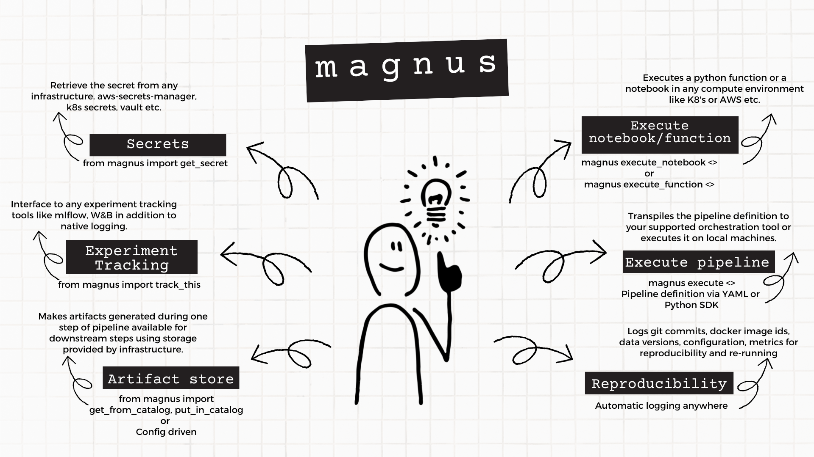

# Hello from magnus


---

**Magnus** is a *thin* layer of abstraction over the underlying infrastructure to enable data scientist and
machine learning engineers. It provides:

- A way to execute Jupyter notebooks/python functions in local or remote platforms.
- A framework to define complex pipelines via YAML or Python SDK.
- Robust and *automatic* logging to ensure maximum reproducibility of experiments.
- A framework to interact with secret managers ranging from environment variables to other vendors.
- Interactions with various experiment tracking tools.

## What does **thin** mean?

- We really have no say in what happens within your notebooks or python functions.
- We do not dictate how the infrastructure should be configured as long as it satisfies some *basic* criteria.
    - The underlying infrastructure should support container execution and an orchestration framework.
    - Some way to handle secrets either via environment variables or secrets manager.
    - A blob storage or some way to store your intermediate artifacts.
    - A database or blob storage to store logs.
- We have no opinion of how your structure your project.
- We do not creep into your CI/CD practices but it is your responsibility to provide the same environment where ever
the execution happens. This is usually via git, virtual environment manager and docker.
- We transpile to the orchestration framework that is used by your teams to do the heavy lifting.

## What does it do?




### Shift Left

Magnus provides patterns typically used in production environments even in the development phase.

- Reduces the need for code refactoring during production phase of the project.
- Enables best practices and understanding of infrastructure patterns.
- Run the same code on your local machines or in production environments.

:sparkles::sparkles:Happy Experimenting!!:sparkles::sparkles:


## Documentation

[More details about the project and how to use it available here](https://astrazeneca.github.io/magnus-core/).

## Installation


The minimum python version that magnus supports is 3.8
## pip

magnus is a python package and should be installed as any other.

```shell
pip install magnus
```

We recommend that you install magnus in a virtual environment specific to the project and also poetry for your
application development.

The command to install in a poetry managed virtual environment

```
poetry add magnus
```

## Example Run

To give you a flavour of how magnus works, lets create a simple pipeline.

Copy the contents of this yaml into getting-started.yaml or alternatively in a python file if you are using the SDK.

---
!!! Note

   The below execution would create a folder called 'data' in the current working directory.
   The command as given should work in linux/macOS but for windows, please change accordingly.

---

``` yaml
dag:
  description: Getting started
  start_at: step parameters
  steps:
    step parameters:
      type: task
      command_type: python-lambda
      command: "lambda x: {'x': int(x) + 1}"
      next: step shell
    step shell:
      type: task
      command_type: shell
      command: mkdir data ; env >> data/data.txt # For Linux/macOS
      next: success
      catalog:
        put:
          - "*"
    success:
      type: success
    fail:
      type: fail
```

The same could also be defined via a Python SDK.

```python

#in pipeline.py
from magnus import Pipeline, Task

def pipeline():
    first = Task(name='step parameters', command="lambda x: {'x': int(x) + 1}", command_type='python-lambda',
                next_node='step shell')
    second = Task(name='step shell', command='mkdir data ; env >> data/data.txt',
                  command_type='shell', catalog={'put': '*'})

    pipeline = Pipeline(name='getting_started')
    pipeline.construct([first, second])
    pipeline.execute(parameters_file='parameters.yaml')

if __name__ == '__main__':
    pipeline()

```

Since the pipeline expects a parameter ```x```, lets provide that using ```parameters.yaml```

```yaml
x: 3
```


And let's run the pipeline using:
``` shell
 magnus execute --file getting-started.yaml --parameters-file parameters.yaml
```

If you are using the python SDK:

```
poetry run python pipeline.py
```

You should see a list of warnings but your terminal output should look something similar to this:

``` json
{
    "run_id": "20230131195647",
    "dag_hash": "",
    "use_cached": false,
    "tag": "",
    "original_run_id": "",
    "status": "SUCCESS",
    "steps": {
        "step parameters": {
            "name": "step parameters",
            "internal_name": "step parameters",
            "status": "SUCCESS",
            "step_type": "task",
            "message": "",
            "mock": false,
            "code_identities": [
                {
                    "code_identifier": "e15d1374aac217f649972d11fe772e61b5a2478d",
                    "code_identifier_type": "git",
                    "code_identifier_dependable": true,
                    "code_identifier_url": "INTENTIONALLY REMOVED",
                    "code_identifier_message": ""
                }
            ],
            "attempts": [
                {
                    "attempt_number": 0,
                    "start_time": "2023-01-31 19:56:55.007931",
                    "end_time": "2023-01-31 19:56:55.009273",
                    "duration": "0:00:00.001342",
                    "status": "SUCCESS",
                    "message": ""
                }
            ],
            "user_defined_metrics": {},
            "branches": {},
            "data_catalog": []
        },
        "step shell": {
            "name": "step shell",
            "internal_name": "step shell",
            "status": "SUCCESS",
            "step_type": "task",
            "message": "",
            "mock": false,
            "code_identities": [
                {
                    "code_identifier": "e15d1374aac217f649972d11fe772e61b5a2478d",
                    "code_identifier_type": "git",
                    "code_identifier_dependable": true,
                    "code_identifier_url": "INTENTIONALLY REMOVED",
                    "code_identifier_message": ""
                }
            ],
            "attempts": [
                {
                    "attempt_number": 0,
                    "start_time": "2023-01-31 19:56:55.128697",
                    "end_time": "2023-01-31 19:56:55.150878",
                    "duration": "0:00:00.022181",
                    "status": "SUCCESS",
                    "message": ""
                }
            ],
            "user_defined_metrics": {},
            "branches": {},
            "data_catalog": [
                {
                    "name": "data/data.txt",
                    "data_hash": "7e91b0a9ff8841a3b5bf2c711f58bcc0cbb6a7f85b9bc92aa65e78cdda59a96e",
                    "catalog_relative_path": "20230131195647/data/data.txt",
                    "catalog_handler_location": ".catalog",
                    "stage": "put"
                }
            ]
        },
        "success": {
            "name": "success",
            "internal_name": "success",
            "status": "SUCCESS",
            "step_type": "success",
            "message": "",
            "mock": false,
            "code_identities": [
                {
                    "code_identifier": "e15d1374aac217f649972d11fe772e61b5a2478d",
                    "code_identifier_type": "git",
                    "code_identifier_dependable": true,
                    "code_identifier_url": "INTENTIONALLY REMOVED",
                    "code_identifier_message": ""
                }
            ],
            "attempts": [
                {
                    "attempt_number": 0,
                    "start_time": "2023-01-31 19:56:55.239877",
                    "end_time": "2023-01-31 19:56:55.240116",
                    "duration": "0:00:00.000239",
                    "status": "SUCCESS",
                    "message": ""
                }
            ],
            "user_defined_metrics": {},
            "branches": {},
            "data_catalog": []
        }
    },
    "parameters": {
        "x": 4
    },
    "run_config": {
        "executor": {
            "type": "local",
            "config": {
                "enable_parallel": false,
                "placeholders": {}
            }
        },
        "run_log_store": {
            "type": "buffered",
            "config": {}
        },
        "catalog": {
            "type": "file-system",
            "config": {
                "compute_data_folder": "data",
                "catalog_location": ".catalog"
            }
        },
        "secrets": {
            "type": "do-nothing",
            "config": {}
        },
        "experiment_tracker": {
            "type": "do-nothing",
            "config": {}
        },
        "variables": {},
        "pipeline": {
            "start_at": "step parameters",
            "name": "getting_started",
            "description": "",
            "max_time": 86400,
            "steps": {
                "step parameters": {
                    "mode_config": {},
                    "next_node": "step shell",
                    "command": "lambda x: {'x': int(x) + 1}",
                    "command_type": "python-lambda",
                    "command_config": {},
                    "catalog": {},
                    "retry": 1,
                    "on_failure": "",
                    "type": "task"
                },
                "step shell": {
                    "mode_config": {},
                    "next_node": "success",
                    "command": "mkdir data ; env >> data/data.txt",
                    "command_type": "shell",
                    "command_config": {},
                    "catalog": {
                        "put": "*"
                    },
                    "retry": 1,
                    "on_failure": "",
                    "type": "task"
                },
                "success": {
                    "mode_config": {},
                    "type": "success"
                },
                "fail": {
                    "mode_config": {},
                    "type": "fail"
                }
            }
        }
    }
}
```

You should see that ```data``` folder being created with a file called ```data.txt``` in it.
This is according to the command in ```step shell```.

You should also see a folder ```.catalog``` being created with a single folder corresponding to the run_id of this run.

To understand more about the input and output, please head over to the
[documentation](https://project-magnus.github.io/magnus-core/).
