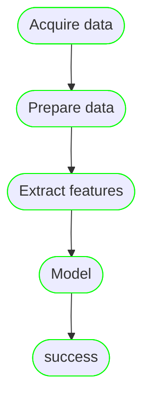

# Hello from magnus


<p align="center">
  
</p>
---

<p align="center">
<a href="https://pypi.org/project/magnus/"></a>
<a href="https://pypi.org/project/magnus/"></a>
<a href="https://github.com/AstraZeneca/magnus-core/blob/main/LICENSE"></a>
<a href="https://github.com/psf/black"></a>
<a href="https://github.com/python/mypy"></a>
<a href="https://github.com/AstraZeneca/magnus-core/actions/workflows/release.yaml">
<a href="https://github.com/AstraZeneca/magnus-core/actions/workflows/docs.yaml">
</p>
---

Magnus is a simplified workflow definition language that helps in:

- **Streamlined Design Process:** Magnus enables users to efficiently plan their pipelines with
[stubbed nodes](https://astrazeneca.github.io/magnus-core/concepts/stub), along with offering support for various structures such as
[tasks](https://astrazeneca.github.io/magnus-core/concepts/task), [parallel branches](https://astrazeneca.github.io/magnus-core/concepts/parallel), and [loops or map branches](https://astrazeneca.github.io/magnus-core/concepts/map)
in both [yaml](https://astrazeneca.github.io/magnus-core/concepts/pipeline) or a [python SDK](https://astrazeneca.github.io/magnus-core/sdk) for maximum flexibility.

- **Incremental Development:** Build your pipeline piece by piece with Magnus, which allows for the
implementation of tasks as [python functions](https://astrazeneca.github.io/magnus-core/concepts/task/#python_functions),
[notebooks](https://astrazeneca.github.io/magnus-core/concepts/task/#notebooks), or [shell scripts](https://astrazeneca.github.io/magnus-core/concepts/task/#shell),
adapting to the developer's preferred tools and methods.

- **Robust Testing:** Ensure your pipeline performs as expected with the ability to test using sampled data. Magnus
also provides the capability to [mock and patch tasks](https://astrazeneca.github.io/magnus-core/configurations/executors/mocked)
for thorough evaluation before full-scale deployment.

- **Seamless Deployment:** Transition from the development stage to production with ease.
Magnus simplifies the process by requiring [only configuration changes](https://astrazeneca.github.io/magnus-core/configurations/overview)
to adapt to different environments, including support for [argo workflows](https://astrazeneca.github.io/magnus-core/configurations/executors/argo).

- **Efficient Debugging:** Quickly identify and resolve issues in pipeline execution with Magnus's local
debugging features. Retrieve data from failed tasks and [retry failures](https://astrazeneca.github.io/magnus-core/concepts/run-log/#retrying_failures)
using your chosen debugging tools to maintain a smooth development experience.

Along with the developer friendly features, magnus also acts as an interface to production grade concepts
such as [data catalog](https://astrazeneca.github.io/magnus-core/concepts/catalog), [reproducibility](https://astrazeneca.github.io/magnus-core/concepts/run-log),
[experiment tracking](https://astrazeneca.github.io/magnus-core/concepts/experiment-tracking)
and secure [access to secrets](https://astrazeneca.github.io/magnus-core/concepts/secrets).


## What does it do?


## Documentation

[More details about the project and how to use it available here](https://astrazeneca.github.io/magnus-core/).


## Installation

<!--- --8<-- [start:installation] -->

The minimum python version that magnus supports is 3.8
## pip

magnus is a python package and should be installed as any other.

```shell
pip install magnus
```

We recommend that you install magnus in a virtual environment specific to the project and also poetry for your
application development.

The command to install in a poetry managed virtual environment

```
poetry add magnus
```

## Example


