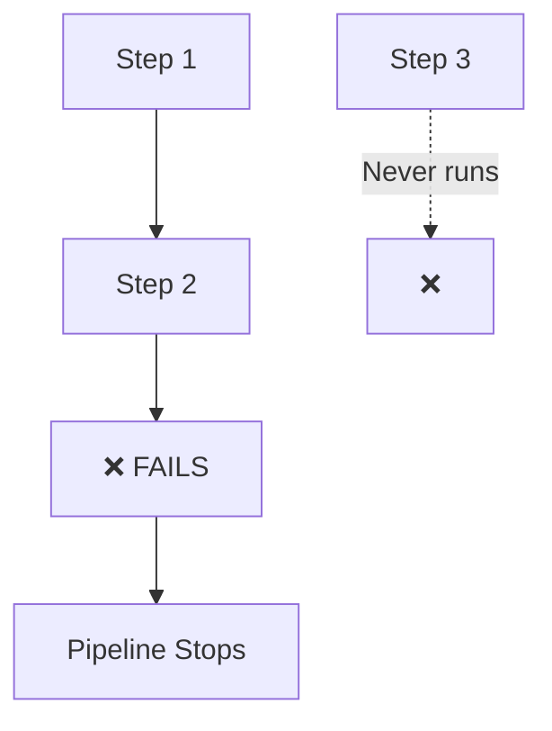
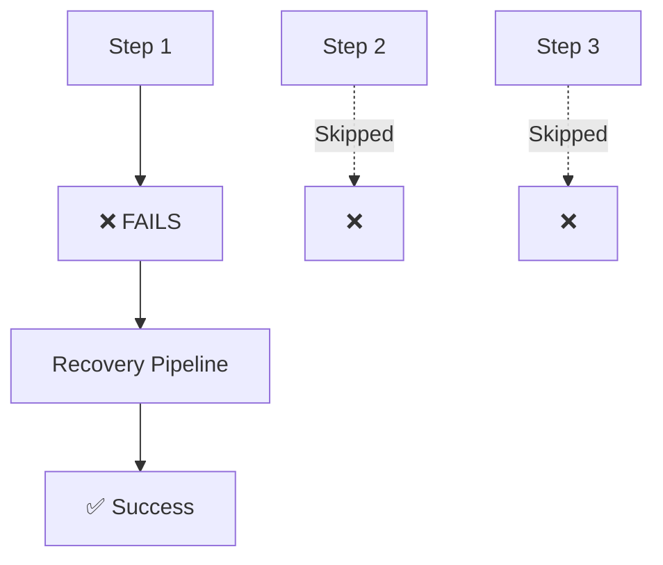
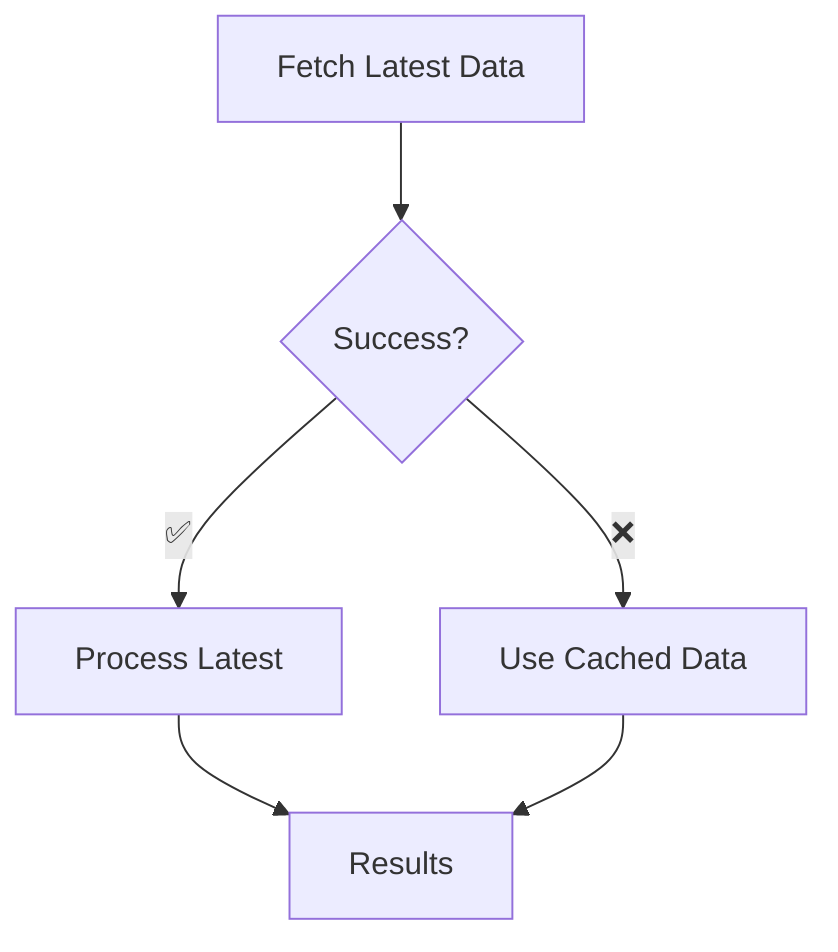

# 🛡️ Failure Handling

Control what happens when tasks fail, with graceful recovery and alternative paths.

## Default behavior

By default, any task failure stops the entire pipeline:



```python
from runnable import Pipeline, PythonTask, Stub
from examples.common.functions import hello, raise_ex

def main():
    # Normal pipeline - fails on any error
    step1 = PythonTask(name="step_1", function=hello)
    step2 = PythonTask(name="step_2", function=raise_ex)  # This will fail!
    step3 = Stub(name="step_3")                           # Never runs

    pipeline = Pipeline(steps=[step1, step2, step3])
    pipeline.execute()  # Stops at step2 failure
    return pipeline

if __name__ == "__main__":
    main()
```

??? example "See complete runnable code"
    ```python title="examples/02-sequential/default_fail.py"
    --8<-- "examples/02-sequential/default_fail.py"
    ```

    **Try it now:**
    ```bash
    uv run examples/02-sequential/default_fail.py
    ```

**Flow:** `step 1` → `step 2` (fails) → pipeline stops

## Custom failure handling

Specify what to do when a task fails:



```python
from runnable import Pipeline, PythonTask, Stub
from examples.common.functions import raise_ex

def main():
    # Create recovery pipeline
    recovery_pipeline = Stub(name="recovery_step").as_pipeline()

    # Set up failure handling
    step_1 = PythonTask(name="step_1", function=raise_ex)  # This will fail
    step_1.on_failure = recovery_pipeline                   # Run this instead

    step_2 = Stub(name="step_2")  # Skipped (normal flow interrupted)
    step_3 = Stub(name="step_3")  # Skipped (normal flow interrupted)

    pipeline = Pipeline(steps=[step_1, step_2, step_3])
    pipeline.execute()  # Runs: step_1 → fails → recovery_pipeline → success!
    return pipeline

if __name__ == "__main__":
    main()
```

??? example "See complete runnable code"
    ```python title="examples/02-sequential/on_failure_succeed.py"
    --8<-- "examples/02-sequential/on_failure_succeed.py"
    ```

    **Try it now:**
    ```bash
    uv run examples/02-sequential/on_failure_succeed.py
    ```

**Flow:** `step_1` (fails) → `step_4` → success

## How it works

```python
step_1.on_failure = recovery_pipeline
```

1. **Task fails** → Normal execution stops
2. **`on_failure` pipeline** executes instead
3. **Recovery pipeline** can succeed or fail
4. **Pipeline continues** if recovery succeeds

## Real-world patterns



### Data fallback
```python
# Example failure handling configuration (partial code)
fetch_latest_data_task.on_failure = use_cached_data_pipeline
```

### Retry with different settings
```python
# Example failure handling configuration (partial code)
fast_model_task.on_failure = robust_model_pipeline
```

### Error reporting
```python
# Example failure handling configuration (partial code)
critical_task.on_failure = send_alert_pipeline
```

### Graceful degradation
```python
# Example failure handling configuration (partial code)
feature_extraction_task.on_failure = use_simple_features_pipeline
```

## Failure pipeline example

**Helper function (creates a recovery pipeline):**
```python
def create_fallback_pipeline():
    log_error = PythonTask(
        name="log_error",
        function=log_failure_details
    )

    use_backup = PythonTask(
        name="use_backup",
        function=load_backup_data,
        returns=["data"]
    )

    return Pipeline(steps=[log_error, use_backup])

# Usage example (partial code)
main_task.on_failure = create_fallback_pipeline()
```

## When to use failure handling

**Essential for:**
- Production pipelines that must complete
- Data pipelines with unreliable sources
- ML pipelines with multiple model options
- External API integrations
- File processing with backup sources

!!! tip "Failure strategy"

    - **Fail fast**: For development and testing
    - **Graceful recovery**: For production systems
    - **Log everything**: Always capture failure details
    - **Test failures**: Verify your recovery paths work

Next: Learn about [mocking and testing](mocking-testing.md).
