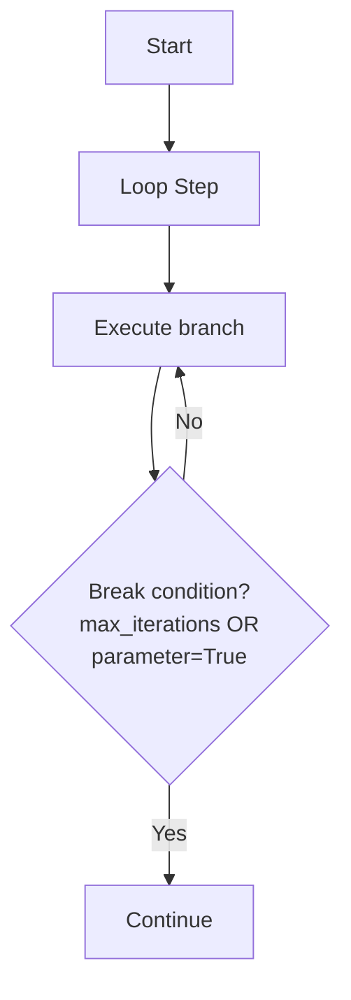

# Loop Patterns

Execute iterative workflows with conditional termination using runnable's Loop node for dynamic repetition patterns.

## Core Loop Concepts

**Loop** enables iterative execution of a branch pipeline until a break condition is met or maximum iterations reached:

- **Branch Pipeline**: A complete pipeline executed on each iteration
- **Break Condition**: Boolean parameter that terminates the loop when `True`
- **Iteration Index**: Environment variable providing current iteration count (0-based)
- **Safety Limit**: Maximum iterations to prevent infinite loops

## Loop Flow Visualization



## Basic Loop Pattern

```python
from runnable.sdk import Pipeline, PythonTask, Loop

def counter_task():
    """Task that increments until reaching 3."""
    import os
    counter = int(os.environ.get("counter", 0))
    should_stop = counter >= 3
    return should_stop

def counter_branch():
    """Branch pipeline executed each iteration."""
    task = PythonTask(
        name="count",
        function=counter_task,
        returns=["should_stop"]
    )
    return Pipeline(steps=[task])

def main():
    loop = Loop(
        name="counter_loop",
        branch=counter_branch(),
        max_iterations=5,         # Safety limit
        break_on="should_stop",   # Exit condition parameter
        index_as="counter"        # Environment variable name
    )

    pipeline = Pipeline(steps=[loop])
    pipeline.execute()
    return pipeline

if __name__ == "__main__":
    main()
```

**How it works**:

1. **Iteration 0**: Loop sets `counter=0` in environment and executes branch
2. **Iteration 1**: Loop sets `counter=1` in environment and executes branch
3. **Iteration N**: Continues until `should_stop` becomes `True` or `max_iterations` reached

## Loop Components

### Branch Pipeline
The branch is a complete Pipeline executed on each iteration:

```python
def processing_branch():
    """Multi-step pipeline executed per iteration."""
    process_task = PythonTask(
        name="process_data",
        function=process_iteration_data,
        returns=["processed_count"]
    )

    check_task = PythonTask(
        name="check_completion",
        function=check_if_done,
        returns=["is_complete"]
    )

    return Pipeline(steps=[process_task, check_task])
```

### Break Condition
Boolean parameter that controls loop termination:

```python
def check_completion():
    """Determine if loop should continue."""
    # Your completion logic here
    completed = some_condition()
    return completed  # Return True to exit loop

task = PythonTask(
    name="checker",
    function=check_completion,
    returns=["loop_complete"]  # This becomes the break_on parameter
)

loop = Loop(
    name="data_loop",
    branch=Pipeline(steps=[task]),
    break_on="loop_complete",  # Parameter name from returns
    # ... other config
)
```

### Iteration Index
Access current iteration count in tasks:

```python
def iteration_aware_task():
    """Task that uses iteration count."""
    import os
    import logging
    logger = logging.getLogger(__name__)

    iteration = int(os.environ.get("iteration_idx", 0))

    logger.info(f"Executing iteration {iteration}")

    # Iteration-specific logic
    batch_size = 100 + (iteration * 10)  # Increase batch size each iteration
    data = fetch_data(limit=batch_size)

    completed = len(data) < batch_size  # Stop when less than expected
    return completed

loop = Loop(
    name="adaptive_loop",
    branch=Pipeline(steps=[task]),
    index_as="iteration_idx",  # Available as environment variable
    break_on="completed",
    max_iterations=10
)
```

## Loop Termination Conditions

Loops terminate when **any** condition is met (checked in order):

### 1. Branch Execution Failure
If any task in the branch fails, loop exits immediately:

```python
def risky_task():
    """Task that might fail."""
    import random
    if random.random() < 0.3:  # 30% chance of failure
        raise ValueError("Simulated processing error")
    return False  # Continue loop

# Loop exits immediately on task failure
# Final status: FAIL
```

### 2. Break Condition Met
When break condition parameter becomes `True`:

```python
def convergence_check():
    """Check if algorithm converged."""
    # Your convergence logic
    error_rate = calculate_error()
    converged = error_rate < 0.01
    return converged

task = PythonTask(
    name="check",
    function=convergence_check,
    returns=["converged"]
)

loop = Loop(
    name="training_loop",
    branch=Pipeline(steps=[task]),
    break_on="converged",  # Exit when converged=True
    max_iterations=1000
)
```

### 3. Maximum Iterations Reached
Safety limit prevents infinite loops:

```python
loop = Loop(
    name="bounded_loop",
    branch=never_ending_branch(),
    break_on="never_true",      # This never becomes True
    max_iterations=5            # Loop stops here (iterations 0,1,2,3,4)
)
# Final iteration count: 4 (0-indexed)
```

## Advanced Loop Patterns

### Data Processing Loop
Process data in batches until complete:

```python
def fetch_batch():
    """Fetch next batch of data."""
    import os
    offset = int(os.environ.get("batch_idx", 0)) * 100

    data = fetch_from_database(limit=100, offset=offset)
    has_more = len(data) == 100

    # Process the batch
    results = process_batch(data)

    return len(results), not has_more  # Count processed, stop when no more data

def main():
    batch_task = PythonTask(
        name="process_batch",
        function=fetch_batch,
        returns=["processed_count", "all_done"]
    )

    batch_loop = Loop(
        name="data_processing",
        branch=Pipeline(steps=[batch_task]),
        break_on="all_done",
        index_as="batch_idx",
        max_iterations=50  # Process max 5000 records (50 * 100)
    )

    pipeline = Pipeline(steps=[batch_loop])
    pipeline.execute()
    return pipeline

if __name__ == "__main__":
    main()
```

### Convergence Loop
Iterative algorithms with convergence criteria:

```python
def training_iteration():
    """Single training iteration."""
    import os
    import logging
    logger = logging.getLogger(__name__)

    epoch = int(os.environ.get("epoch", 0))

    # Train model for one epoch
    model_loss = train_epoch(epoch)

    # Check convergence
    converged = model_loss < 0.001

    logger.info(f"Epoch {epoch}: loss={model_loss:.6f}, converged={converged}")

    return model_loss, converged

def main():
    train_task = PythonTask(
        name="train_epoch",
        function=training_iteration,
        returns=["loss", "converged"]
    )

    training_loop = Loop(
        name="model_training",
        branch=Pipeline(steps=[train_task]),
        break_on="converged",
        index_as="epoch",
        max_iterations=100
    )

    pipeline = Pipeline(steps=[training_loop])
    pipeline.execute()
    return pipeline

if __name__ == "__main__":
    main()
```

### Retry with Backoff
Implement retry logic with exponential backoff:

```python
def attempt_operation():
    """Attempt operation with increasing delay."""
    import os
    import time
    import random
    import logging
    logger = logging.getLogger(__name__)

    attempt = int(os.environ.get("attempt", 0))

    # Exponential backoff delay
    if attempt > 0:
        delay = 2 ** attempt  # 2, 4, 8, 16 seconds
        time.sleep(delay)

    # Simulate operation with decreasing failure rate
    success_rate = 0.3 + (attempt * 0.2)  # 30%, 50%, 70%, 90% success
    success = random.random() < success_rate

    if not success:
        logger.warning(f"Attempt {attempt} failed, retrying...")
    else:
        logger.info(f"Attempt {attempt} succeeded!")

    return success

def main():
    retry_task = PythonTask(
        name="retry_operation",
        function=attempt_operation,
        returns=["success"]
    )

    retry_loop = Loop(
        name="retry_with_backoff",
        branch=Pipeline(steps=[retry_task]),
        break_on="success",
        index_as="attempt",
        max_iterations=5  # Max 5 attempts
    )

    pipeline = Pipeline(steps=[retry_loop])
    pipeline.execute()
    return pipeline

if __name__ == "__main__":
    main()
```

## Parameter Flow in Loops

### Iteration Parameter Inheritance
Parameters flow between iterations:

- **Iteration 0**: Inherits from parent scope
- **Iteration N**: Inherits from iteration N-1
- **Loop Exit**: Final iteration parameters copied back to parent scope

```python
def accumulator_task(running_total: int = 0):
    """Task that accumulates values across iterations."""
    import os
    import logging
    logger = logging.getLogger(__name__)

    iteration = int(os.environ.get("idx", 0))

    # Add current iteration value
    running_total += iteration * 10  # 0, 10, 20, 30, ...

    # Stop after 5 iterations
    done = iteration >= 4

    logger.info(f"Iteration {iteration}: total={running_total}")

    return running_total, done

def main():
    accumulate_task = PythonTask(
        name="accumulate",
        function=accumulator_task,
        returns=["running_total", "done"]
    )

    loop = Loop(
        name="accumulator",
        branch=Pipeline(steps=[accumulate_task]),
        break_on="done",
        index_as="idx",
        max_iterations=10
    )

    # Task after loop has access to final running_total
    def show_final(running_total):
        import logging
        logger = logging.getLogger(__name__)
        logger.info(f"Final total: {running_total}")

    final_task = PythonTask(
        name="show_final",
        function=show_final,
        returns=[]
    )

    pipeline = Pipeline(steps=[loop, final_task])
    pipeline.execute()
    return pipeline

if __name__ == "__main__":
    main()
```

## Error Handling in Loops

### Branch Failure Behavior
When any task in the branch fails:

```python
def failing_branch():
    """Branch that might fail."""
    failing_task = PythonTask(
        name="might_fail",
        function=lambda: 1/0,  # This will fail
        returns=[]
    )
    return Pipeline(steps=[failing_task])

# Loop exits immediately with FAIL status
# No further iterations executed
# Parameters from failed iteration are not copied back
```

### Graceful Error Handling
Handle errors within the branch:

```python
def robust_task():
    """Task with internal error handling."""
    import logging
    logger = logging.getLogger(__name__)

    try:
        # Risky operation
        result = risky_operation()
        return result, False  # Success, continue
    except Exception as e:
        logger.error(f"Error handled: {e}")
        return None, True  # Error handled, stop loop

task = PythonTask(
    name="robust",
    function=robust_task,
    returns=["result", "should_stop"]
)

# Loop continues normally, stops gracefully on handled error
```

## Loop Configuration Reference

```python
Loop(
    name="loop_name",                 # Required: Unique identifier
    branch=Pipeline(steps=[...]),     # Required: Pipeline to execute per iteration
    max_iterations=10,                # Required: Safety limit (prevent infinite loops)
    break_on="done",                  # Required: Boolean parameter name for exit condition
    index_as="iteration",             # Required: Environment variable name for iteration count

    # Standard node options
    next_node="next_step",            # Optional: Next node after loop completion
    terminate_with_success=False,     # Optional: End pipeline successfully after loop
    terminate_with_failure=False,     # Optional: End pipeline with failure after loop
)
```

**Parameter Types**:

- `name`: String identifier for the loop node
- `branch`: Pipeline instance (not executed, passed as template)
- `max_iterations`: Positive integer (1 or greater)
- `break_on`: String matching a boolean return parameter from branch tasks
- `index_as`: String for environment variable name (alphanumeric recommended)

**Common Patterns**:

- **Data Processing**: `break_on="no_more_data"`, `index_as="batch"`
- **Training Loops**: `break_on="converged"`, `index_as="epoch"`
- **Retry Logic**: `break_on="success"`, `index_as="attempt"`
- **Polling**: `break_on="ready"`, `index_as="check"`

## Best Practices

### 1. Always Set Reasonable max_iterations
Prevent infinite loops with conservative limits:

```python
# Good: Reasonable safety limits
Loop(max_iterations=100)   # Training: 100 epochs max
Loop(max_iterations=5)     # Retry: 5 attempts max
Loop(max_iterations=1000)  # Data processing: 100k records max

# Avoid: Too high or too low
Loop(max_iterations=999999)  # Too high - potential runaway
Loop(max_iterations=1)       # Too low - barely iterative
```

### 2. Use Descriptive Environment Variable Names
Choose clear names for iteration indices:

```python
# Good: Context-specific names
Loop(index_as="epoch")        # Machine learning
Loop(index_as="batch_num")    # Data processing
Loop(index_as="attempt")      # Retry logic
Loop(index_as="round")        # Iterative algorithms

# Avoid: Generic names
Loop(index_as="i")           # Unclear purpose
Loop(index_as="counter")     # Generic
```

### 3. Implement Proper Break Conditions
Ensure break conditions are reliable:

```python
# Good: Clear boolean return
def check_done():
    completed = all_work_finished()
    return completed  # Always boolean

# Good: Handle edge cases
def safe_check():
    try:
        return is_complete()
    except Exception:
        return True  # Stop on errors

# Avoid: Non-boolean returns
def bad_check():
    return "maybe"  # Not boolean!
```

### 4. Monitor Loop Progress
Add logging for debugging:

```python
def logged_task():
    import os
    import logging
    logger = logging.getLogger(__name__)

    iteration = int(os.environ.get("iter", 0))

    logger.info(f"Starting iteration {iteration}")

    # Your processing logic
    result = process_data()

    done = check_completion()
    logger.info(f"Iteration {iteration} complete, done={done}")

    return done
```

## Loop vs Map Comparison

**Use Loop when**:

- Unknown number of iterations
- Conditional termination based on results
- Sequential processing with state accumulation
- Retry/polling patterns

**Use Map when**:

- Known collection of items to process
- Each iteration is independent
- Parallel processing possible
- Simple iteration over data

```python
# Loop: Unknown iterations
Loop(
    branch=process_until_converged(),
    break_on="converged",
    max_iterations=100
)

# Map: Known iterations
Map(
    branch=process_item(),
    iterate_on="items",  # List of items
    iterate_as="item"    # Current item variable
)
```

**Next**: Learn about [Map Patterns](map-patterns.md) for processing collections of data.
