# 🔄 Retry & Recovery

Re-execute failed pipelines while preserving successful steps and enabling cross-environment debugging.

## The Problem

Your production pipeline fails at step 3 out of 5 after running expensive computation. Traditional approaches mean starting from scratch:

```mermaid
flowchart TD
    A[Step 1: Load Data ✅] --> B[Step 2: Train Model ✅]
    B --> C[❌ Step 3: Deploy FAILS]
    C --> D[Step 4: Test ❌]
    D --> E[Step 5: Notify ❌]

    F[Traditional Retry: Start Over] -.-> A
    G[✨ Runnable Retry: Resume from Step 3] -.-> C

    classDef highlight stroke:#ff6b35,stroke-width:3px,stroke-dasharray: 5 5
    class G highlight
```



**Problems with starting over:**

- ❌ Lose expensive computation (data loading + model training)
- ❌ Debugging in production is slow and risky
- ❌ No way to test fixes in local environment first
- ❌ Waste compute resources and time

## The Runnable Solution: Surgical Retry

Runnable's retry system preserves successful work and enables cross-environment debugging. Instead of restarting failed pipelines from scratch, only the failed steps and subsequent steps re-execute.

```python
# Same pipeline structure, different environments
from runnable import Pipeline, PythonTask

def main():
    pipeline = Pipeline(steps=[
        PythonTask(function=load_data, name="load_data"),
        PythonTask(function=train_model, name="train_model"),
        PythonTask(function=deploy_model, name="deploy"),  # This failed
        PythonTask(function=run_tests, name="test"),
        PythonTask(function=send_notification, name="notify"),
    ])

    pipeline.execute()  # Environment determined by configuration
    return pipeline
```

## Production Failed? Debug Locally

Your Argo pipeline just failed at the deployment step after 2 hours of expensive model training. What do you do?

**The Runnable Way: Cross-Environment Debugging**

Fix your code locally and retry using the **exact same run data** from production, while preserving all the expensive work:

```bash
# 1. Your Argo pipeline failed (after expensive training succeeded)
argo submit prod-pipeline.yaml -p run_id=prod-failure-001
# Output: FAILED at step 3 (deploy), steps 1-2 (load data + train model) succeeded

# 2. Switch to local environment, same run_id, MODIFIED code
RUNNABLE_RETRY_RUN_ID=prod-failure-001 \
RUNNABLE_CONFIGURATION_FILE=local.yaml \
uv run my_pipeline.py

# What happens:
# Step 1 (load data): ⏩ SKIPPED - already successful in production
# Step 2 (train model): ⏩ SKIPPED - already successful in production
# Step 3 (deploy): 🔧 EXECUTES locally with your FIXED code
# Step 4 (test): ✅ EXECUTES if step 3 succeeds
# Step 5 (notify): ✅ EXECUTES if step 4 succeeds
```

**Fix the bug in your code:**

```python
def deploy_model(model_data):
    # Add your debug fixes here - code changes are allowed!
    print(f"DEBUG: Model data shape: {model_data.shape}")

    # Fix the original bug that caused production failure
    deploy_url = get_deployment_url()  # This was missing!

    # Deploy with fixed logic
    return deploy_model_to_endpoint(model_data, deploy_url)
```

**Deploy the fix back to production:**

```bash
# 3. Once working locally, deploy fix to production
RUNNABLE_RETRY_RUN_ID=prod-failure-001 \
argo submit prod-pipeline.yaml -p retry_run_id=prod-failure-001 -p retry_indicator=2
# Only the failed steps execute in production with your fixes
```

### Why This Changes Everything

**🔧 Fix Code, Keep Data**
Modify your functions to fix bugs while reusing the **exact same data artifacts** from the production run.

**⚡ Zero Waste Development**
The expensive model training (2 hours) runs once in production. Every debug iteration reuses that work.

**🛡️ Production Safety**
Debug and test code fixes on your laptop. Only deploy to production once you know it works.

**🌍 Cross-Environment Freedom**
Same pipeline structure, same parameters, same data - but **different code and different execution environment**.

!!! tip "What Can Change vs What's Locked"

    **✅ Can Change (Debugging Freedom):**

    - Function implementations (fix bugs, add logging)
    - Execution environment (local, container, Argo)
    - Configuration files (resources, storage, etc.)

    **🔒 Must Stay Same (Safety Constraints):**

    - Pipeline structure (same steps, same order)
    - Step names and connections
    - Parameters (uses original run's parameters)

## How Surgical Retry Works

Under the hood, Runnable's retry system uses four key mechanisms to enable safe cross-environment debugging:

### Environment Detection

Retry mode activates automatically when the `RUNNABLE_RETRY_RUN_ID` environment variable is set. This single environment variable transforms normal execution into retry behavior:

```bash
# Normal execution
uv run my_pipeline.py

# Retry execution - automatically detects and activates retry logic
RUNNABLE_RETRY_RUN_ID=prod-failure-001 uv run my_pipeline.py
```

The system checks for this variable at startup. When present, it switches to retry mode and uses the specified run ID to locate the original execution data.

### Step Skipping Logic

During retry, each step is evaluated against the original run's execution history:

1. **Check Original Status** - Query the run log store for the step's previous execution
2. **Success Check** - If the last attempt was successful, skip the step entirely
3. **Failure Check** - If the step failed or was never executed, run it with your new code
4. **Terminal Nodes** - Always execute terminal success/failure nodes for proper cleanup

This surgical approach means only failed and downstream steps re-execute, preserving all expensive successful work.

### Safety Validations

Before retry begins, the system validates structural consistency:

- **DAG Hash Verification** - Ensures pipeline structure (steps, connections) hasn't changed
- **Parameter Preservation** - Uses original run's parameters, ignoring any new parameter files
- **Run Log Availability** - Confirms the original run data is accessible in the run log store

If validation fails, retry is blocked to prevent data corruption or inconsistent results.

### Attempt Tracking

The retry system maintains complete execution continuity through dual environment variables:

- **`RUNNABLE_RETRY_RUN_ID`** - Links to the original failed run's data and execution context
- **`RUNNABLE_RETRY_INDICATOR`** - Tracks which retry attempt this is (e.g., "2" for second attempt)

This enables sophisticated retry chain tracking:

- **Preserves History** - Original attempts and their results remain intact
- **New Attempts** - Only re-executed steps get new attempt entries tagged with the retry indicator
- **Cross-Environment Consistency** - Same run ID works across local, container, and cloud environments
- **Multi-Stage Retries** - Can retry a retry, with each stage properly tracked via retry indicators

This ensures debugging sessions maintain full traceability from the original production failure through multiple retry attempts to the successful fix.

## Try the Retry Examples

**Try the retry examples now:**
```bash
# Simple retry example
uv run examples/09-retry/simple_task.py

# Linear pipeline retry
uv run examples/09-retry/linear.py

# Complex workflows with retry
uv run examples/09-retry/parallel.py
uv run examples/09-retry/conditional.py
uv run examples/09-retry/map.py
```

**Related:** [Failure Handling](failure-handling.md) - Alternative execution paths vs retry
