# 🔀 Conditional Workflows

Make your pipeline choose different paths based on data or results.

## The pattern


```python
from runnable import Conditional, Pipeline, PythonTask, Stub

def main():
    # Step 1: Make a decision
    toss_task = PythonTask(
        function=toss_function,    # Returns "heads" or "tails"
        returns=["toss"],          # Named return for conditional to use
        name="toss_task"
    )

    # Step 2: Branch based on decision
    conditional = Conditional(
        parameter="toss",          # Use the "toss" value from above
        branches={
            "heads": create_heads_pipeline(),    # Run this if toss="heads"
            "tails": create_tails_pipeline()     # Run this if toss="tails"
        },
        name="conditional"
    )

    # Step 3: Continue after branching
    continue_step = Stub(name="continue_processing")

    pipeline = Pipeline(steps=[toss_task, conditional, continue_step])
    pipeline.execute()
    return pipeline

if __name__ == "__main__":
    main()
```

??? example "See complete runnable code"
    ```python title="examples/02-sequential/conditional.py"
    --8<-- "examples/02-sequential/conditional.py"
    ```

    **Try it now:**
    ```bash
    uv run examples/02-sequential/conditional.py
    ```

## How it works

1. **`toss_task`** returns a value named `"toss"`
2. **`Conditional`** uses `parameter="toss"` to check that value
3. **`branches={}`** maps values to different pipelines
4. **Only one branch** executes based on the parameter value

## The decision function

**Helper function (makes the decision):**
```python
import random

def toss_function():
    # Simulate a coin toss
    toss = random.choice(["heads", "tails"])
    print(f"Toss result: {toss}")
    return toss  # Returns "heads" or "tails"
```

Returns `"heads"` or `"tails"` - the conditional uses this to pick a branch.

## Branch pipelines

**Helper functions (create the branch pipelines):**
```python
def create_heads_pipeline():
    return PythonTask(
        function=when_heads_function,
        name="when_heads_task"
    ).as_pipeline()

def create_tails_pipeline():
    return PythonTask(
        function=when_tails_function,
        name="when_tails_task"
    ).as_pipeline()
```

Each branch is a complete pipeline that runs independently.

## Real-world examples

```mermaid
flowchart TD
    A[Data Input] --> B[Quality Check]
    B --> C{data_quality}
    C -->|good| D[Direct Analysis]
    C -->|needs_cleaning| E[Clean → Analysis]
    C -->|invalid| F[Error Handling]
    D --> G[Results]
    E --> G
    F --> G
```



**Data validation:**
```python
# Example conditional configuration (partial code)
conditional = Conditional(
    parameter="data_quality",  # returns "good", "needs_cleaning", "invalid"
    branches={
        "good": analysis_pipeline,
        "needs_cleaning": cleanup_then_analysis_pipeline,
        "invalid": error_handling_pipeline
    }
)
```

**Model selection:**
```python
# Example conditional configuration (partial code)
conditional = Conditional(
    parameter="dataset_size",  # returns "small", "medium", "large"
    branches={
        "small": simple_model_pipeline,
        "medium": ensemble_pipeline,
        "large": distributed_training_pipeline
    }
)
```

**Environment routing:**
```python
# Example conditional configuration (partial code)
conditional = Conditional(
    parameter="environment",  # returns "dev", "staging", "prod"
    branches={
        "dev": fast_testing_pipeline,
        "staging": full_validation_pipeline,
        "prod": production_pipeline
    }
)
```

!!! tip "Conditional tips"

    - Always provide a branch for every possible return value
    - Use meaningful parameter names like `"status"`, `"environment"`, `"model_type"`
    - Consider using enums in your decision functions for type safety

Next: Learn about [failure handling](failure-handling.md).
