# 🔀 Conditional Workflows

Make your pipeline choose different paths based on data or results.

## The pattern


```python linenums="1"
--8<-- "examples/02-sequential/conditional.py:39:56"
```

## How it works

1. **`toss_task`** returns a value named `"toss"`
2. **`Conditional`** uses `parameter="toss"` to check that value
3. **`branches={}`** maps values to different pipelines
4. **Only one branch** executes based on the parameter value

## The decision function

```python linenums="1"
--8<-- "examples/02-sequential/conditional.py:12:26"
```

Returns `"heads"` or `"tails"` - the conditional uses this to pick a branch.

## Branch pipelines

```python linenums="1"
--8<-- "examples/02-sequential/conditional.py:29:37"
```

Each branch is a complete pipeline that runs independently.

## Real-world examples

```mermaid
flowchart TD
    A[Data Input] --> B[Quality Check]
    B --> C{data_quality}
    C -->|good| D[Direct Analysis]
    C -->|needs_cleaning| E[Clean → Analysis]
    C -->|invalid| F[Error Handling]
    D --> G[Results]
    E --> G
    F --> G
```



**Data validation:**
```python
# Check data quality, route accordingly
parameter="data_quality"  # returns "good", "needs_cleaning", "invalid"
branches={
    "good": analysis_pipeline,
    "needs_cleaning": cleanup_then_analysis_pipeline,
    "invalid": error_handling_pipeline
}
```

**Model selection:**
```python
# Choose model based on data size
parameter="dataset_size"  # returns "small", "medium", "large"
branches={
    "small": simple_model_pipeline,
    "medium": ensemble_pipeline,
    "large": distributed_training_pipeline
}
```

**Environment routing:**
```python
# Different behavior per environment
parameter="environment"  # returns "dev", "staging", "prod"
branches={
    "dev": fast_testing_pipeline,
    "staging": full_validation_pipeline,
    "prod": production_pipeline
}
```

!!! tip "Conditional tips"

    - Always provide a branch for every possible return value
    - Use meaningful parameter names like `"status"`, `"environment"`, `"model_type"`
    - Consider using enums in your decision functions for type safety

Next: Learn about [failure handling](failure-handling.md).
