# 🛡️ Failure Handling

Control what happens when tasks fail, with graceful recovery and alternative paths.

## Default behavior

By default, any task failure stops the entire pipeline:

```mermaid
flowchart TD
    A[Step 1] --> B[Step 2]
    B --> C[❌ FAILS]
    C --> D[Pipeline Stops]
    E[Step 3] -.->|Never runs| F[❌]
```



```python linenums="1"
--8<-- "examples/02-sequential/default_fail.py:27:36"
```

**Flow:** `step 1` → `step 2` (fails) → pipeline stops

## Custom failure handling

Specify what to do when a task fails:

```mermaid
flowchart TD
    A[Step 1] --> B[❌ FAILS]
    B --> C[Recovery Pipeline]
    C --> D[✅ Success]
    E[Step 2] -.->|Skipped| F[❌]
    G[Step 3] -.->|Skipped| H[❌]
```



```python linenums="1"
--8<-- "examples/02-sequential/on_failure_succeed.py:32:45"
```

**Flow:** `step_1` (fails) → `step_4` → success

## How it works

```python
step_1.on_failure = recovery_pipeline
```

1. **Task fails** → Normal execution stops
2. **`on_failure` pipeline** executes instead
3. **Recovery pipeline** can succeed or fail
4. **Pipeline continues** if recovery succeeds

## Real-world patterns

```mermaid
flowchart TD
    A[Fetch Latest Data] --> B{Success?}
    B -->|✅| C[Process Latest]
    B -->|❌| D[Use Cached Data]
    C --> E[Results]
    D --> E
```



### Data fallback
```python
fetch_latest_data_task.on_failure = use_cached_data_pipeline
```

### Retry with different settings
```python
fast_model_task.on_failure = robust_model_pipeline
```

### Error reporting
```python
critical_task.on_failure = send_alert_pipeline
```

### Graceful degradation
```python
feature_extraction_task.on_failure = use_simple_features_pipeline
```

## Failure pipeline example

```python
def create_fallback_pipeline():
    log_error = PythonTask(
        name="log_error",
        function=log_failure_details
    )

    use_backup = PythonTask(
        name="use_backup",
        function=load_backup_data,
        returns=["data"]
    )

    return Pipeline(steps=[log_error, use_backup])

# Use it
main_task.on_failure = create_fallback_pipeline()
```

## When to use failure handling

**Essential for:**
- Production pipelines that must complete
- Data pipelines with unreliable sources
- ML pipelines with multiple model options
- External API integrations
- File processing with backup sources

!!! tip "Failure strategy"

    - **Fail fast**: For development and testing
    - **Graceful recovery**: For production systems
    - **Log everything**: Always capture failure details
    - **Test failures**: Verify your recovery paths work

Next: Learn about [mocking and testing](mocking-testing.md).
