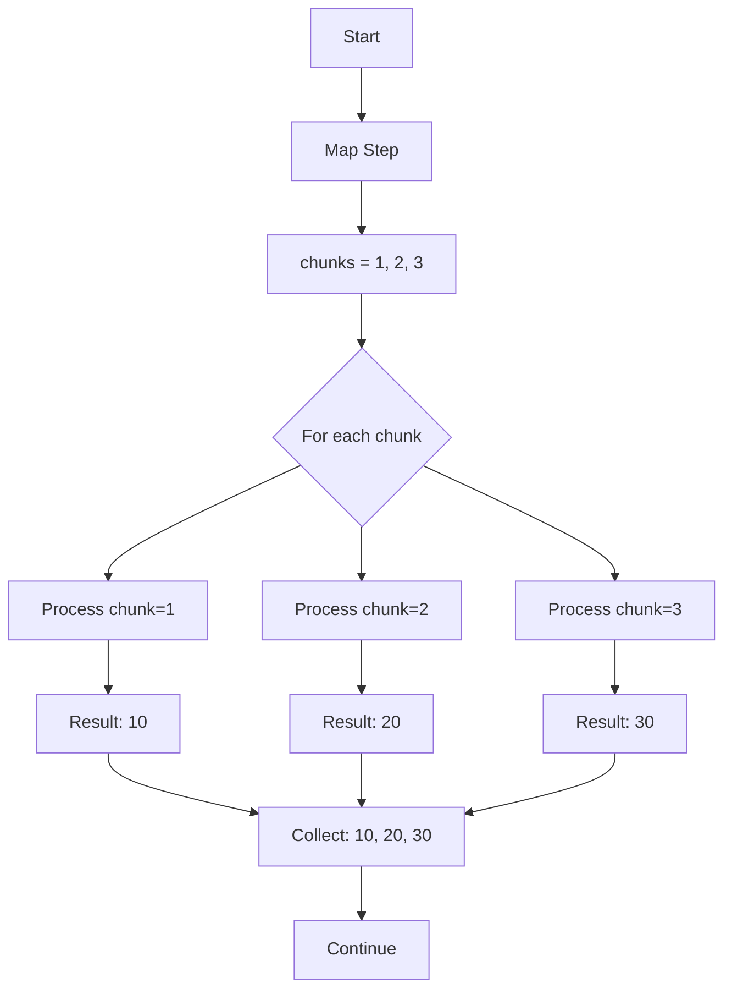
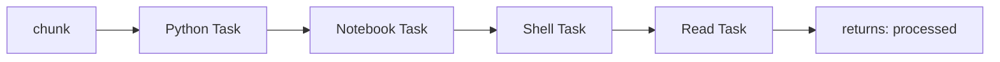
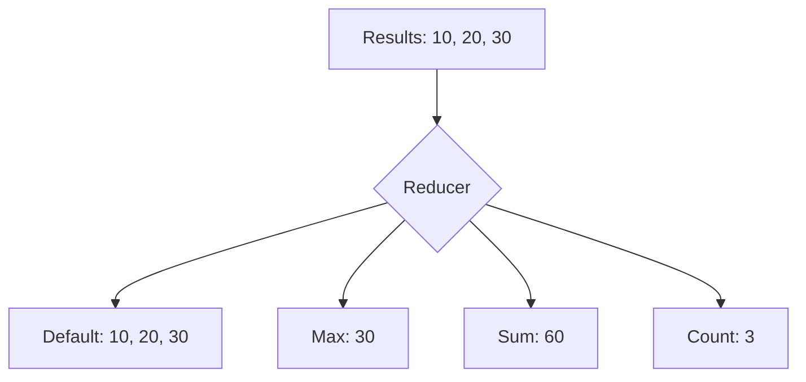

# 🔄 Map Patterns

Process collections of data with the same workflow - like a for loop for pipelines.

## The basic pattern



```python
from runnable import Map, Pipeline, PythonTask

# Create a map step that processes each chunk
map_state = Map(
    name="process_chunks",
    iterate_on="chunks",           # Parameter name containing [1, 2, 3]
    iterate_as="chunk",           # Each iteration gets chunk=1, chunk=2, chunk=3
    branch=create_processing_workflow()  # Same workflow runs for each chunk
)

# Collect results after all iterations
collect_results = PythonTask(function=collect_all_results, name="collect")

pipeline = Pipeline(steps=[map_state, collect_results])
pipeline.execute(parameters_file="parameters.yaml")  # Contains chunks: [1, 2, 3]
```

??? example "See complete runnable code"
    ```python title="examples/07-map/map.py"
    --8<-- "examples/07-map/map.py"
    ```

    **Try it now:**
    ```bash
    uv run examples/07-map/map.py
    ```

Like writing:
```python
chunks = [1, 2, 3]
results = []
for chunk in chunks:
    result = process_chunk(chunk)
    results.append(result)
```

## The branch workflow

Each iteration runs this pipeline with different `chunk` values:

```python
def create_processing_workflow():
    from runnable import Pipeline, PythonTask, NotebookTask, ShellTask

    # Process chunk through multiple steps
    python_step = PythonTask(
        function=process_chunk,           # chunk=1 → processed_python=10
        returns=["processed_python"]
    )

    notebook_step = NotebookTask(
        notebook="process_chunk.ipynb",   # processed_python=10 → processed_notebook=100
        returns=["processed_notebook"]
    )

    shell_step = ShellTask(
        command="./process_chunk.sh",     # processed_notebook=100 → processed_shell=1000
        returns=["processed_shell"]
    )

    return Pipeline(steps=[python_step, notebook_step, shell_step])
```

Each iteration runs the same pipeline structure:



## 🔧 Custom reducers

By default, map collects all results into lists. Customize this with reducers:



```python
from runnable import Map

# Use custom reducer to aggregate results
map_state = Map(
    name="process_with_max",
    iterate_on="chunks",                    # [1, 2, 3]
    iterate_as="chunk",
    reducer="lambda *x: max(x)",           # Take maximum instead of collecting all
    branch=create_processing_workflow()
)

# Results: processed_python = max(10, 20, 30) = 30
#          processed_notebook = max(100, 200, 300) = 300
#          processed_shell = max(1000, 2000, 3000) = 3000
```

??? example "See complete runnable code"
    ```python title="examples/07-map/custom_reducer.py"
    --8<-- "examples/07-map/custom_reducer.py"
    ```

    **Try it now:**
    ```bash
    uv run examples/07-map/custom_reducer.py
    ```

Common reducers:

- `"lambda *x: max(x)"` → Maximum value
- `"lambda *x: sum(x)"` → Sum all values
- `"lambda *x: len(x)"` → Count items
- `"lambda *x: x[0]"` → Take first result only

## When to use map

**Perfect for:**

- Processing file collections
- Batch processing data chunks
- Cross-validation in ML
- Parameter sweeps
- A/B testing multiple variants

**Example use cases:**
```python
# Process multiple datasets
iterate_on="datasets", iterate_as="dataset"

# Test hyperparameters
iterate_on="learning_rates", iterate_as="lr"

# Handle batch processing
iterate_on="file_paths", iterate_as="file_path"
```

!!! tip "Map vs Parallel"

    - **Map**: Same workflow, different data (for loop)
    - **Parallel**: Different workflows, same time (independent tasks)

Next: Learn about [conditional workflows](conditional-workflows.md).
