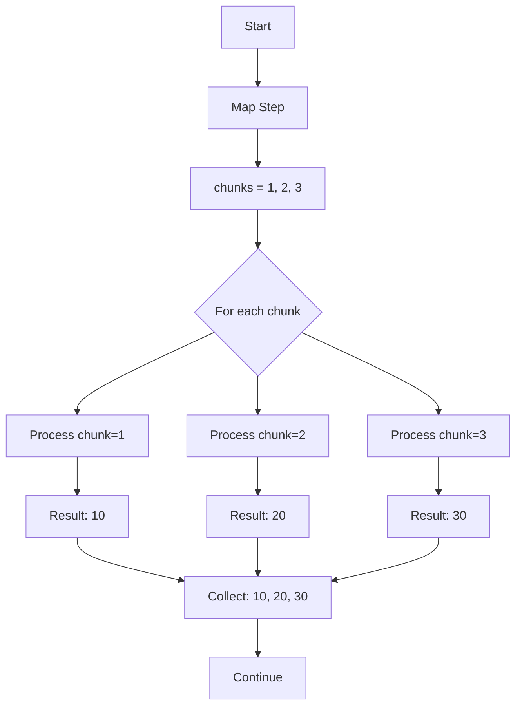
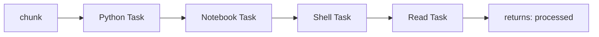
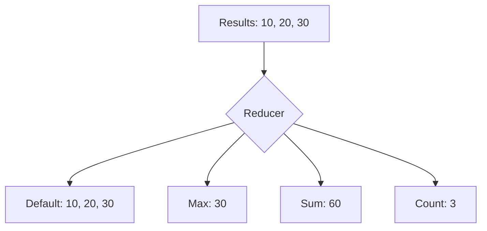

# 🔄 Map Patterns

Process collections of data with the same workflow - like a for loop for pipelines.

## The basic pattern



```python linenums="1"
--8<-- "examples/07-map/map.py:87:108"
```

Like writing:
```python
chunks = [1, 2, 3]
results = []
for chunk in chunks:
    result = process_chunk(chunk)
    results.append(result)
```

## The branch workflow

Each iteration runs this pipeline with different `chunk` values:

```python linenums="1"
--8<-- "examples/07-map/map.py:15:83"
```

## The branch workflow

Each iteration runs the same pipeline structure:



## 🔧 Custom reducers

By default, map collects all results into lists. Customize this with reducers:



```python linenums="1"
--8<-- "examples/07-map/custom_reducer.py:111:117"
```

Common reducers:
- `"lambda *x: max(x)"` → Maximum value
- `"lambda *x: sum(x)"` → Sum all values
- `"lambda *x: len(x)"` → Count items
- `"lambda *x: x[0]"` → Take first result only

## When to use map

**Perfect for:**
- Processing file collections
- Batch processing data chunks
- Cross-validation in ML
- Parameter sweeps
- A/B testing multiple variants

**Example use cases:**
```python
# Process multiple datasets
iterate_on="datasets", iterate_as="dataset"

# Test hyperparameters
iterate_on="learning_rates", iterate_as="lr"

# Handle batch processing
iterate_on="file_paths", iterate_as="file_path"
```

!!! tip "Map vs Parallel"

    - **Map**: Same workflow, different data (for loop)
    - **Parallel**: Different workflows, same time (independent tasks)

Next: Learn about [conditional workflows](conditional-workflows.md).
