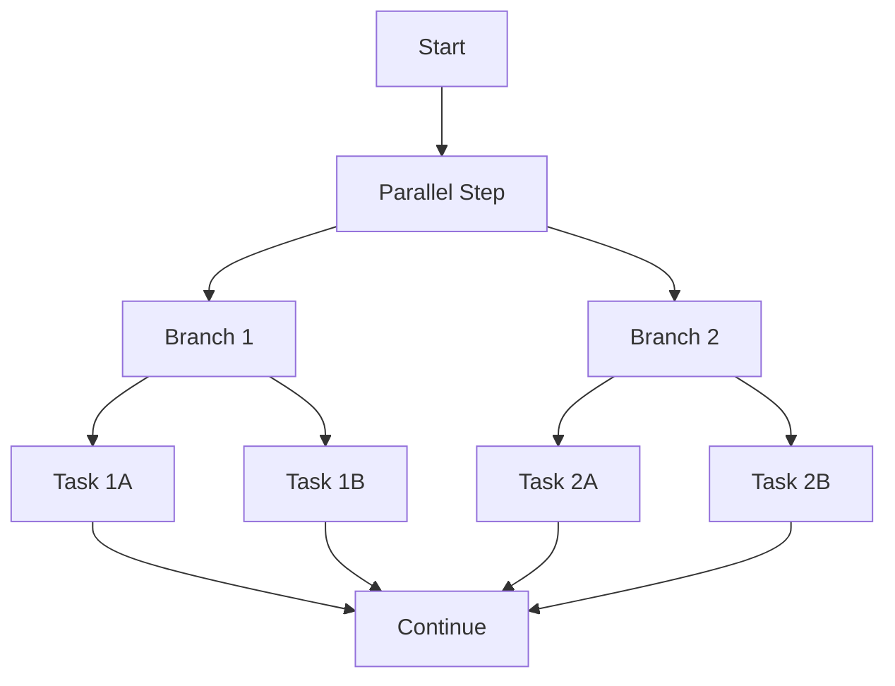
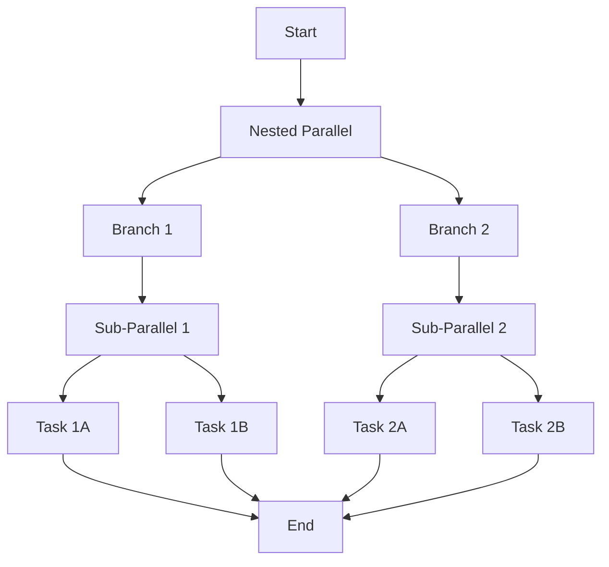

# ⚡ Parallel Execution

Speed up workflows by running independent tasks simultaneously.

## The pattern

When tasks don't depend on each other, run them in parallel:



```python linenums="1"
--8<-- "examples/06-parallel/parallel.py:46:59"
```

## How it works

1. **`Parallel()`** → Creates parallel execution container
2. **`branches={}`** → Define independent workflows
3. **Same interface** → Each branch is a regular pipeline
4. **Automatic synchronization** → All branches complete before continuing

## Real workflow example

```python linenums="1"
--8<-- "examples/06-parallel/parallel.py:11:42"
```

Each branch runs the same workflow independently - perfect for processing different data sources or running multiple models.

## ♾️ Infinite nesting

Parallel steps can contain other parallel steps:



```python linenums="1"
--8<-- "examples/06-parallel/nesting.py:70:83"
```

!!! tip "When to use parallel"

    - Independent data processing streams
    - Running multiple ML models
    - Parallel feature engineering
    - Processing different file formats

Next: Learn about [map patterns](map-patterns.md) for iterative processing.
