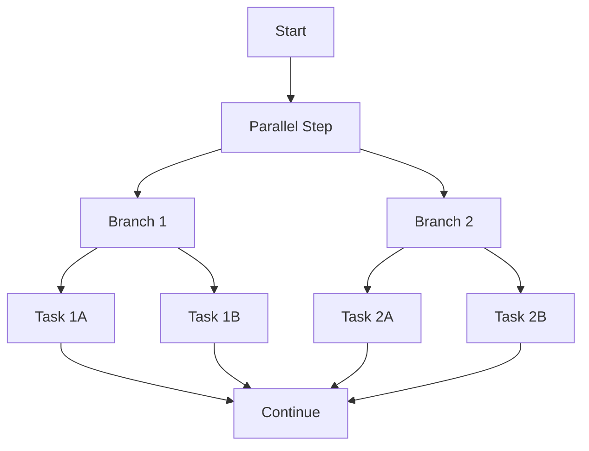
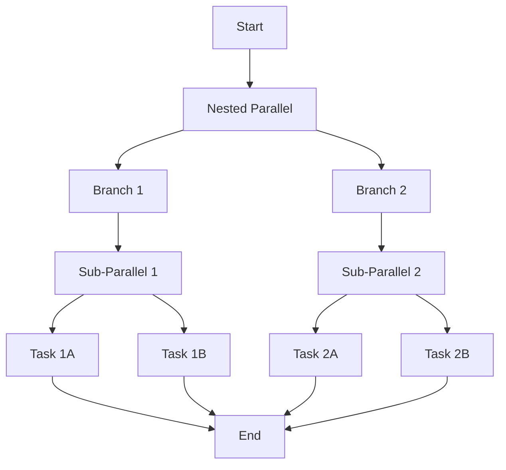

# ⚡ Parallel Execution

Speed up workflows by running independent tasks simultaneously.

## The pattern

When tasks don't depend on each other, run them in parallel:



```python
from runnable import Parallel, Pipeline, Stub

def main():
    # Create the parallel step
    parallel_step = Parallel(
        name="parallel_step",
        branches={
            "branch1": create_workflow(),  # Same workflow, independent execution
            "branch2": create_workflow(),  # Same workflow, independent execution
        }
    )

    # Continue after all branches complete
    continue_step = Stub(name="continue_processing")

    pipeline = Pipeline(steps=[parallel_step, continue_step])
    pipeline.execute()
    return pipeline

if __name__ == "__main__":
    main()
```

??? example "See complete runnable code"
    ```python title="examples/06-parallel/parallel.py"
    --8<-- "examples/06-parallel/parallel.py"
    ```

    **Try it now:**
    ```bash
    uv run examples/06-parallel/parallel.py
    ```

## How it works

1. **`Parallel()`** → Creates parallel execution container
2. **`branches={}`** → Define independent workflows
3. **Same interface** → Each branch is a regular pipeline
4. **Automatic synchronization** → All branches complete before continuing

## Real workflow example

**Helper function (creates the workflow for each branch):**
```python
def create_workflow():
    from runnable import Pipeline, PythonTask, ShellTask, NotebookTask, Stub
    from examples.common.functions import hello

    # Each branch runs this same workflow independently
    steps = [
        Stub(name="hello_stub"),
        PythonTask(function=hello, name="hello_python"),
        ShellTask(command="echo 'Hello World!'", name="hello_shell"),
        NotebookTask(notebook="examples/common/simple_notebook.ipynb",
                    name="hello_notebook", terminate_with_success=True)
    ]

    return Pipeline(steps=steps)
```

Each branch runs the same workflow independently - perfect for processing different data sources or running multiple models.

## ♾️ Infinite nesting

Parallel steps can contain other parallel steps:



```python
from runnable import Parallel, Pipeline

def main():
    # Nested parallel: Each branch is itself a parallel pipeline
    nested_parallel = Parallel(
        name="nested_parallel",
        branches={
            "branch1": parallel_pipeline(),  # This is a parallel pipeline
            "branch2": parallel_pipeline()   # This is also a parallel pipeline
        }
    )

    pipeline = Pipeline(steps=[nested_parallel])
    pipeline.execute()
    return pipeline

if __name__ == "__main__":
    main()
```

??? example "See complete runnable code"
    ```python title="examples/06-parallel/nesting.py"
    --8<-- "examples/06-parallel/nesting.py"
    ```

    **Try it now:**
    ```bash
    uv run examples/06-parallel/nesting.py
    ```

!!! tip "When to use parallel"

    - Independent data processing streams
    - Running multiple ML models
    - Parallel feature engineering
    - Processing different file formats

Next: Learn about [map patterns](map-patterns.md) for iterative processing.
