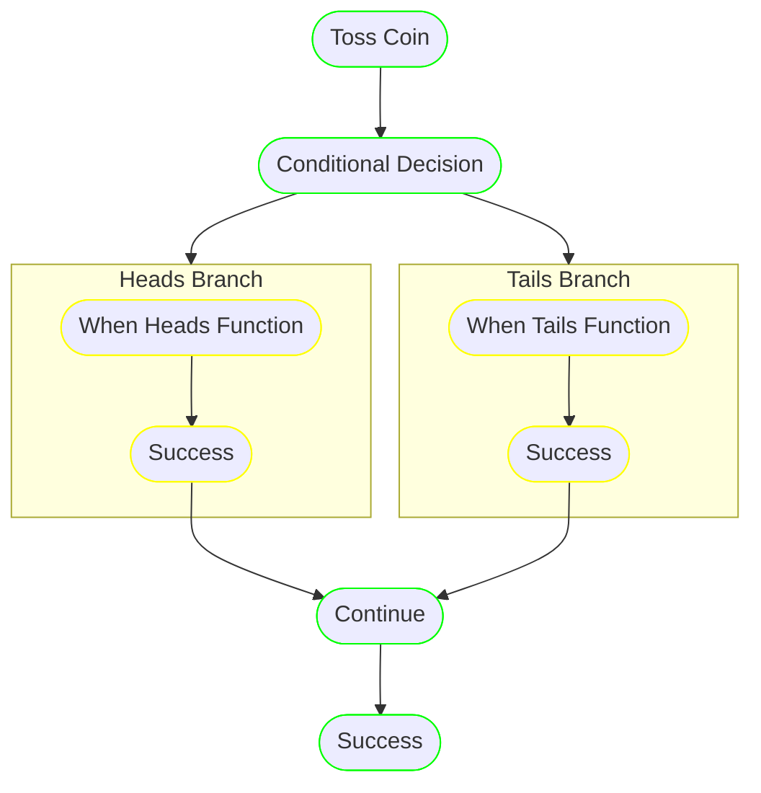

```conditional``` nodes in runnable allow executing different pipelines based on parameter values.

## Concept

A simple example is a coin toss that determines which branch of processing to execute. This demonstrates how a single parameter value can route execution to completely different pipelines.



The branches for ```heads``` and ```tails``` are pipelines themselves and are defined as any other [pipeline](pipeline.md).

The step ```Conditional Decision``` is a conditional step that has ```branches``` as individual pipelines, selected based on the ```toss``` parameter value.

[API Documentation](../reference.md/#conditional)

## Syntax

Conceptually, a conditional node can be represented in python as:

```python
toss_result = toss_coin()  # Returns "heads" or "tails"

if toss_result == "heads":
    # Execute heads pipeline
    when_heads_function()
elif toss_result == "tails":
    # Execute tails pipeline
    when_tails_function()
```

The ```runnable``` syntax for the coin toss example:

```python linenums="1"
--8<-- "examples/02-sequential/conditional.py"
```

Key concepts in this example:

- `[concept:branch-pipeline]`: Convert tasks to pipelines using `.as_pipeline()` for use as branches
- `[concept:conditional]`: The conditional node with branch definitions and parameter selection
- `[concept:task-with-returns]`: Task that returns the `toss` parameter determining which branch to execute
- `[concept:stub]`: Placeholder task to continue processing after conditional branch completes
- `[concept:pipeline]`: Sequential pipeline combining all steps
- `[concept:execution]`: Pipeline execution

## Traversal

A branch of a conditional step is considered successful only if the ```success``` step is reached at the end.
The steps of the pipeline can fail and be handled by [on failure](../concepts/pipeline.md/#on_failure) and
redirected to ```success``` if that is the desired behavior.

The conditional step is considered successful when the selected branch terminates successfully.

### Branch Selection

- The conditional node evaluates the specified parameter value
- It selects the branch whose key matches the parameter value exactly
- If no branch matches, the conditional step fails
- Only one branch is executed per conditional step


## Complete Example

```python linenums="1"
--8<-- "examples/02-sequential/conditional.py"
```

!!! tip "Use Cases"

    Conditional nodes are particularly useful for:

    - **Data quality branching**: Different processing based on data characteristics
    - **Model selection**: Choosing algorithms based on dataset size or type
    - **Environment-specific logic**: Different behavior for dev/staging/prod
    - **Error handling**: Fallback pipelines when primary approaches fail
    - **A/B testing**: Routing traffic to different experimental pipelines
