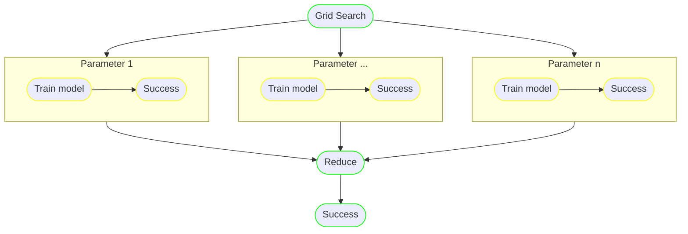

```map``` nodes in runnable allows to execute a [pipeline](pipeline.md) for all the items in a list.

## Concept

A relatable example from data science would be doing a grid search over hyper parameters where the training pipeline needs
to run on every hyper parameter.




The ```reduce``` step is part of the ```map```  state definition.


[API Documentation](../reference.md/#map)

Conceptually, map node can be represented in python as:

```python
for i in iterable_parameter:
    # a pipeline of steps
    x = execute_first_step(i)
    score = execute_second_step(i, x)

reduce(score) # could be as simple as a list of scores indexed by i or a custom reducer function/lambda
...
```


## Syntax

The ```runnable``` syntax for the above example:


=== "sdk"

    ```python linenums="1"
    from runnable import PythonTask, Map, Pipeline

    def execute_first_step(i): # (1)
        ...

        return x # (2)

    def execute_second_step(i, x): # (3)
        ...

    def get_iterable_branch(): # (4)
        first_step_task = PythonTask(name="execute_first_step",
                        function="execute_first_step",
                        returns=["x"])

        second_step_task = PythonTask(name="execute_second_step",
                        function="execute_second_step",
                        terminate_with_success=True)

        pipeline = Pipeline(steps=[first_step_task,second_step_task])

    def main():
        generate_task = PythonTask(name="generate_task",
                            function="generate",
                            returns=["iterable_parameter"]) # (5)

        iterate_task = Map(name="iterate",
                        branch=get_iterable_branch(),
                        iterate_on="iterable_parameter", # (6)
                        iterate_as="i",
                        terminate_with_success=True) # (7)

        pipeline = Pipeline(steps=[generate_task, iterate_task])

        pipeline.execute()
        return pipeline

    if __name__ == "__main__":
        main()

    ```

    1. Takes in an input parameter ```i```, the current value of the iteration.
    2. returns a parameter ```x```.
    3. ```i``` is the current value of iteration, ```x``` is the return parameter of function call at iteration ```i```.
    4. returns a ```pipeline``` whose tasks are dependent on an iterable ```i```
    5. returns the parameter ```iterable_parameter```.
    6. loop over ```iterable_parameter``` executing ```iterable_branch``` over each value of ```i```.
    7. Present ```i``` as input argument to all tasks of ```iterable_branch```.


=== "yaml"

    ```yaml linenums="1"
    branch: &branch # (1)
    start_at: execute_first_step
    steps:
      execute_first_step: # (2)
        type: task
        command: execute_first_step
        next: execute_second_step
        returns:
          - x # (3)
      execute_second_step:
        type: task
        command: execute_second_step # (4)
        next: success


    dag:
    start_at: generate_task
    steps:
      generate_task:
        type: task
        command: generate
        returns:
          - iterable_parameter # (5)
      iterate_task:
        type: map
        branch: *branch # (6)
        iterate_on: iterable_parameter # (7)
        iterate_as: i # (8)
        next: success
    ```

    1. The pipeline to iterate over an iterable parameter
    2. The ```task``` expects ```i```, the current value of iteration.
    3. The ```task``` returns ```x```.
    4. The ```task``` expects ```i```, the current value of iteration and ```x``` at the current iteration.
    5. returns a iterable, ```iterable_parameter```.
    6. the branch to iterate over
    7. the parameter to iterate on, returned by a task ```generate_task```.
    8. present the current value of iteration as ```i``` to all the tasks of the branch.


## Reduce

### Default behavior

The [returns](parameters.md/#access_returns) of the tasks of the iterable branch are reduced to a list indexed
by the order of ```iterable```. In the above example, there would be ```parameter``` available for downstream steps of
```iterate_task``` that is a list of all ```x```s observed during the iteration.

For clarity, the default reducer is: ```lambda *x: list(x)  # returns a list of the args```

### Custom reduce

The ```map``` state also accepts a argument ```reducer``` which could be a ```lambda``` or ```function``` that
accepts ```*args``` (a non-keyword variable length argument list) and returns a reduced value.
The downstream steps of ```iterate_task``` would use the reduced value.


## Traversal

A branch of a map step is considered success only if the ```success``` step is reached at the end.
The steps of the pipeline can fail and be handled by [on failure](../concepts/pipeline.md/#on_failure) and
redirected to ```success``` if that is the desired behavior.

The map step is considered successful only if all the branches of the step have terminated successfully.


## Complete example

=== "Default reducer"

    Uses the default reducer

    === "sdk"

        ```python linenums="1"
        --8<-- "examples/07-map/map.py"
        ```

    === "yaml"

        ```yaml linenums="1"
        --8<-- "examples/07-map/map.yaml"
        ```

=== "Custom reducer"

    Differs from default reducer to a ```lambda *x: max(x)``` reducer.

    === "sdk"

        ```python linenums="1"
        --8<-- "examples/07-map/custom_reducer.py"
        ```

    === "yaml"

        ```yaml linenums="1"
        --8<-- "examples/07-map/custom_reducer.yaml"
        ```
