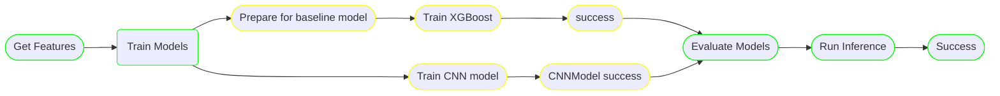

```parallel``` node in runnable embed multiple ```pipeline``` as branches.

[API Documentation](../reference.md/#parallel)

---

## Concept

The below diagram shows training a baseline model and CNN model in parallel and picking the best
model for inference.




The branch for training the ```baseline``` and ```cnn``` are pipelines themselves are defined as any other [pipeline](pipeline.md).

The step ```Train Models``` is a parallel step that has the ```branches``` as the individual pipelines.

## Syntax

=== "sdk"

    ```python linenums="1"
    from runnable import Pipeline, Parallel
    def get_baseline_pipeline():
        ...
        pipeline = Pipeline(...)
        return pipeline

    def get_cnn_pipeline():
        ...
        pipeline = Pipeline(...)
        return pipeline

    def main():
        train_models = Parallel(name="train models",
                        branches={'baseline': get_baseline_pipeline, 'cnn': get_cnn_pipeline()},
                        terminate_with_success=True)
        pipeline = Pipeline(steps=[train_models])

        pipeline.execute

        return pipeline
    ```

=== "yaml"

    ```yaml linenums="1"
    branch: &baseline
    start_at: prepare
    steps:
        ...

    branch: &cnn
    start_at: train
    steps:
        ...

    dag:
    description: |
        This example demonstrates the use of the Parallel step.

        parallel step takes a mapping of branches which are pipelines themselves.

    start_at: parallel_step
    steps:
        parallel_step:
        type: parallel
        next: success
        branches:
          baseline: *baseline
          cnn: *cnn

    ```

!!! warning "Execution"

    The pipelines of the parallel branch should not execute during the definition of ```parallel``` step.
    In case, you want to execute the individual branches in isolation, use a flag to control it.

    eg: the functions ```get_baseline``` and ```get_cnn``` can take a argument ```execute``` which is defaulted to True.
    During the composition of ```parallel``` step, pass in execute as False.

## Traversal

A branch of a parallel step is considered success only if the ```success``` step is reached at the end.
The steps of the pipeline can fail and be handled by [on failure](../concepts/pipeline.md/#on_failure) and
redirected to ```success``` if that is the desired behavior.

The parallel step is considered successful only if all the branches of the step have terminated successfully.

## Complete example

=== "sdk"

    ```python linenums="1" hl_lines="53-57"
    --8<-- "examples/06-parallel/parallel.py"
    ```

=== "yaml"

    ```yaml linenums="1" hl_lines="40-45"
    --8<-- "examples/06-parallel/parallel.yaml"
    ```
