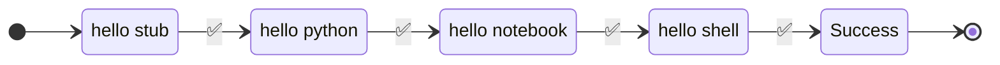

In **runnable**, we use the words

- ```workflows``` and ```pipeline``` interchangeably.
- ```nodes```, ```steps``` interchangeably.

A ```workflow``` is a sequence of ```steps``` to perform.


!!! info "Composite pipelines"


    ```runnable``` pipelines are composable. For example, a pipeline can have
    a parallel node which in itself has many pipelines running in parallel.

<br>

## Concept

A visual example of a workflow:



???+ abstract "Traversal"

    Start at ```hello stub```.

    If it is successful, go to ```next``` step of the pipeline until we reach the success state.

    Any failure in execution of step would, by default, go to the ```fail``` state.


## Syntax

The above pipeline can be written in runnable as below. It is a mixed bag of
[python functions](task.md/#python-functions), [notebook](task.md/#notebook), [shell](task.md/#shell)
and [stub](task.md/#stub).

[API Documentation](../reference.md/#pipeline)


=== "sdk"

    - [x] The first step of the ```steps``` is the start of the workflow.
    - [x] The order of execution follows the order of the tasks in the list.
    - [x] The terminal nodes ```success``` and ```fail``` are added automatically.

    ```python linenums="1"
    --8<-- "examples/02-sequential/traversal.py"
    ```

    1. Start the pipeline.
    2. The order of the steps is the execution order


=== "yaml"

    - [x] The first step  is the step corresponding to ```start_at```
    - [x] The mapping defined in the steps.
    - [x] The ```next``` step after a successful execution of a ```step```.
    - [x] ```success``` as ```next``` node implies successful execution of the pipeline.

    ```yaml linenums="1"
    --8<-- "examples/02-sequential/traversal.yaml"
    ```

    1. Start the pipeline at this step.
    2. State the ```next``` node, if it succeeds.
    3. Add the success and fail nodes.


<br>


## on failure

By default, any failure during the execution of step will traverse to ```fail``` node
marking the execution as failed.

The ```fail``` node is implicitly added to the pipeline.


This behavior can be over-ridden to follow a different path based on expected failures.

### on failure success


```step 1``` fails as the function raises an exception.
```step 4``` is an alternate node to a successful execution.

```step 4``` is the step to execution in case of the failure.

=== "pseudo code"

    ```python

    try:
        raise_exception()
    except:
        # suppress exception
        do_something()

    ```

=== "sdk"

    ```python linenums="1" hl_lines="24 29 34 31"
    --8<-- "examples/02-sequential/on_failure_succeed.py"
    ```

    1. ```terminate_with_success``` is ```true``` traverses to success node.


=== "yaml"

    ```yaml linenums="1" hl_lines="23 25 32-34"
    --8<-- "examples/02-sequential/on_failure_succeed.yaml"
    ```


### On failure fail

```step 1``` fails as the function raises an exception.
```step 4``` is an alternate node to a successful execution.

```step 4``` is the step to execution in case of the failure.

=== "pseudo code"

    ```python

    try:
        raise_exception()
    except:
        # raise exception after doing something.
        do_something()
        raise

    ```

=== "sdk"

    ```python linenums="1" hl_lines="24 29 34 31"
    --8<-- "examples/02-sequential/on_failure_fail.py"
    ```

    1. ```terminate_with_failure``` is ```true``` traverses to fail node.


=== "yaml"

    ```yaml linenums="1" hl_lines="23 25 32-34"
    --8<-- "examples/02-sequential/on_failure_fail.yaml"
    ```
