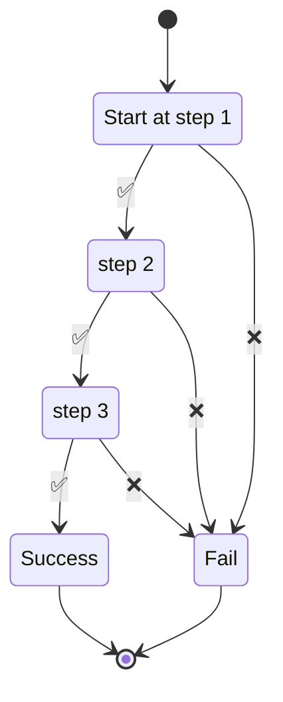

???+ tip inline end "Steps"

    In runnable, a step can be a simple ```task``` or ```stub``` or complex nested pipelines like
    ```parallel``` branches, embedded ```dags``` or dynamic workflows.

    In this section, we use ```stub``` for convenience. For more in depth information about other types,
    please see the relevant section.


In **runnable**, we use the words

- ```dag```, ```workflows``` and ```pipeline``` interchangeably.
- ```nodes```, ```steps``` interchangeably.


Dag or directed acyclic graphs are a way to define your pipelines.
Its a graph representation of the list of tasks you want to perform and the order of it.


<br>


## Example

Below is an example pipeline.


=== "yaml"

    ``` yaml linenums="1"
    --8<-- "examples/concepts/traversal.yaml"
    ```


=== "python"

    ``` python linenums="1"
    --8<-- "examples/concepts/traversal.py"
    ```

<br>

A closer look at the example:


## start_at

- [x] start_at step is the starting node of the traversal.


=== "yaml"

    The value should be valid key in ```steps```

    ```yaml linenums="10" hl_lines="1"
    --8<-- "examples/concepts/traversal.yaml:10:12"
    ```

=== "python"

    The node should be part of ```steps```

    ```python linenums="32" hl_lines="3"
    --8<-- "examples/concepts/traversal.py:32:36"
    ```

By using a ```parallel``` node as starting node, you can get the behavior of multi-root graph.

<br>

## Steps

- [x] Apart from the terminal nodes (```success``` and ```fail```), the pipeline should have at least
one more node.


???+ warning inline end "Step names"

    In runnable, the names of steps should not have ```%``` or ```.``` in them.

    You can name them as descriptive as you want.


=== "yaml"

    ```yaml linenums="12"
    --8<-- "examples/concepts/traversal.yaml:12:21"
    ```

=== "python"


    ```python linenums="14" hl_lines="1-6 19-23"
    --8<-- "examples/concepts/traversal.py:14:36"
    ```

<br>

## Linking

- [x] All nodes except for ```success``` and ```fail``` nodes need to have a ```next```
step to execute upon successful execution.


Visually, the above pipeline can be seen as:

???+ abstract inline end "Traversal"

    Start at step1.

    If it is successful, go to ```next``` step of the pipeline until we reach the success state.

    Any failure in execution of step would, by default, go to the fail state.





=== "yaml"

    ```yaml linenums="15" hl_lines="4 7 10"
    --8<-- "examples/concepts/traversal.yaml:12:21"
    ```

=== "python"


    ```python linenums="14" hl_lines="7-17"
    --8<-- "examples/concepts/traversal.py:14:36"
    ```


### on failure

By default, any failure during the execution of step will traverse to ```fail``` node
marking the execution as failed. You can override this behavior by using ```on_failure```

=== "yaml"

    ```yaml hl_lines="21"
    --8<-- "examples/on-failure.yaml"
    ```

=== "python"

    ```python hl_lines="10"
    --8<-- "examples/on_failure.py"
    ```

=== "traversal"

    ```mermaid
    stateDiagram-v2
        state "Start at step 1" as start_at
        state "step 2" as step_2
        state "step 3" as step_3
        state "Success" as success


        [*] --> start_at
        start_at --> step_2 : #10060;
        start_at --> step_3 : #9989;
        step_3 --> success : #9989;
        success --> [*]
    ```


<br>

## Terminating
- [x] All pipelines should have one and only one Success and Fail state

Reaching one of these states as part of traversal indicates the status of the pipeline.

=== "yaml"

    The type determines the node to be a ```success``` or ``fail`` state.

    The name can be anything that you prefer.

    ``` yaml linenums="1"
    --8<-- "examples/concepts/traversal.yaml:22:25"
    ```

=== "python"

    Setting ```add_terminal_nodes``` to be ```true``` during pipeline creation adds
    ```success``` and ```fail``` states with the names success and fail.

    ``` python linenums="1" hl_lines="4"
    --8<-- "examples/concepts/traversal.py:31:35"
    ```

    Individual steps can link

    - success state by setting ```terminate_with_success``` to ```True```
    - fail state by setting ```terminate_with_fail``` to ```True```

    You can, alternatively, create a ```success``` and ```fail``` state and link them together.

    ```python
    from runnable import Success, Fail

    success = Success(name="Custom Success")
    fail = Fail(name="Custom Failure")

    ```
