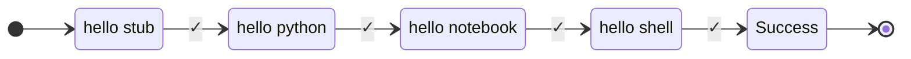

In **runnable**, we use the words

- ```workflows``` and ```pipeline``` interchangeably.
- ```nodes```, ```steps``` interchangeably.

A ```workflow``` is a sequence of ```steps``` to perform.


!!! info "Composite pipelines"


    ```runnable``` pipelines are composable. For example, a pipeline can have
    a parallel node which in itself has many pipelines running in parallel.

<br>

## Concept

A visual example of a workflow:



???+ abstract "Traversal"

    Start at ```hello stub```.

    If it is successful, go to ```next``` step of the pipeline until we reach the success state.

    Any failure in execution of step would, by default, go to the ```fail``` state.


## Syntax

The above pipeline can be written in runnable as below. It is a mixed bag of
[python functions](task.md/#python-functions), [notebook](task.md/#notebook), [shell](task.md/#shell)
and [stub](task.md/#stub).

[API Documentation](../reference.md/#pipeline)

- [x] The first step of the ```steps``` is the start of the workflow.
- [x] The order of execution follows the order of the tasks in the list.
- [x] The terminal nodes ```success``` and ```fail``` are added automatically.

```python linenums="1"
--8<-- "examples/02-sequential/traversal.py"
```

Key concepts in this example:

- `[concept:stub-task]`: Placeholder tasks for testing/development
- `[concept:python-task]`: Execute Python functions
- `[concept:shell-task]`: Execute shell commands
- `[concept:notebook-task]`: Execute Jupyter notebooks
- `[concept:pipeline]`: Creating a pipeline with multiple tasks in sequence
- `[concept:execution]`: Running the pipeline - tasks execute in the order they appear in the steps list

<br>


## on failure

By default, any failure during the execution of step will traverse to ```fail``` node
marking the execution as failed.

The ```fail``` node is implicitly added to the pipeline.


This behavior can be over-ridden to follow a different path based on expected failures.

### on failure success


```step 1``` fails as the function raises an exception.

```step 4``` is a single node pipeline to execute if ```step1``` fails. The failure
pipeline can have as many steps as needed.


=== "pseudo code"

    ```python

    try:
        raise_exception()
    except:
        # suppress exception
        do_something()

    ```

=== "Python SDK"

    ```python linenums="1"
    --8<-- "examples/02-sequential/on_failure_succeed.py"
    ```

    Key concepts in this example:

    - `[concept:failing-task]`: Task that will raise an exception (`raise_ex` function)
    - `[concept:failure-pipeline]`: Pipeline to execute when a task fails (`.as_pipeline()`)
    - `[concept:failure-handling]`: Assigning failure pipeline to task (`step_1.on_failure`)
    - `[concept:pipeline]`: Creating a pipeline with failure-prone task
    - `[concept:execution]`: Running the pipeline - recovery pattern converts failure into success


### On failure fail

```step 1``` fails as the function raises an exception.

```step 4``` is a single node pipeline to execute if ```step1``` fails. The failure
pipeline can have as many steps as needed.


=== "pseudo code"

    ```python

    try:
        raise_exception()
    except:
        # raise exception after doing something.
        do_something()
        raise

    ```

=== "Python SDK"

    ```python linenums="1"
    --8<-- "examples/02-sequential/on_failure_fail.py"
    ```

    Key concepts in this example:

    - `[concept:failing-task]`: Task that will raise an exception (`raise_ex` function)
    - `[concept:failure-pipeline-with-termination]`: Pipeline that terminates with failure (`terminate_with_failure=True`)
    - `[concept:failure-handling]`: Assigning failure pipeline to task (`step_1.on_failure`)
    - `[concept:pipeline]`: Creating a pipeline with failure-prone task
    - `[concept:execution]`: Running the pipeline - cleanup pattern performs actions while still propagating the failure
