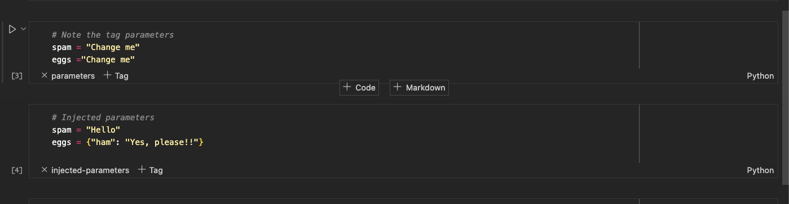

Task nodes are the execution units of the pipeline.

In magnus, a ```command``` in a task node can be [python functions](#python_functions),
[Jupyter notebooks](#notebook) or a [shell scripts](#shell).
All task nodes  can take arguments, retrieve and create files/objects and return
arguments, though their access patterns are different.


In the below examples, we define a pipeline either using python SDK or yaml format but both are equivalent
and all the pipelines can be expressed in either formats.


---

## Python functions

Python is the default ```command type``` of a task node. The ```command```
should be the dotted path to the python function.

!!! example "Dotted path"

    Assuming the below project structure:

    - The ```command``` for the ```outer_function``` should be ```outer_functions.outer_function```

    - The ```command``` for ```inner_function``` should be ```module_inner.inner_functions.inner_function```


        ```
        ..
        ├── outer_functions.py
        │   ├── outer_function()
        ├── module_inner
        │   ├── inner_functions.py
        │   |    ├── inner_function()
        ..

        ```

### Example

=== "python"

    !!! tip inline end "Structuring"

        It is best to keep the application specific functions in a different module
        than the pipeline definition, if you are using Python SDK.

        In this example, we combined them as one module for convenience.


    ```python linenums="1" hl_lines="4-8"
    --8<-- "examples/concepts/simple.py"
    ```

=== "yaml"

    You can execute this by magnus execute -f examples/concepts/simple.yaml

    ```python linenums="1"
    --8<-- "examples/concepts/simple.yaml"
    ```


### Closer look


Lines 4-8 in the python code defines the function that we want to execute as
 part of the pipeline. They are *plain old python functions*.

The rest of the python code (or yaml) defines and executes a pipeline that executes a task whose ```command```
is to execute this function.


### Fields

- ```command``` : Should refer to the function in dotted path notation (#python_functions).
- ```command_type```: Defaults to python and not needed for python task types.
- [next](../pipeline/#linking): is required for any step of the pipeline except for success and fail steps.
- [on_failure](../pipeline/#on_failure): Name of the step to execute if the step fails.
- catalog: Optional required for data access patterns from/to the central storage.


### Accessing parameters

!!! tip "Mutability"

    Functions mutating the input parameters is idiomatic is python. However, functions as part of magnus
    pipeline should return the mutated parameters for downstream steps to have access to them.

    For example, unless the function ```mutating_function``` returns the updated parameters, magnus will
    not know about the change.


    ```python
    d = {"name": "monty"}
    print(d)
    ">>> {'name': 'monty'}"

    def mutating_function(input_dict):
        input_dict["name"] = "python"


    mutating_function(d)
    print(d)
    ">>>{'name': 'python'}"
    ```


Please refer to [Initial Parameters](../parameters/#initial_parameters) for more information about setting
initial parameters.

Lets assume that the initial parameters are:

```yaml
--8<-- "examples/concepts/parameters.yaml"
```

- [x] Passing parameters between steps


=== "Natively"

    Internally, magnus stores the parameters in serialised json format.

    ### ^^Input arguments to the function^^

    Any arguments passed into the function should be at the root level of the json object.
    Arguments with type annotations will be casted appropriately.
    Arguments with no type annotation will be sent in as ```dict```.

    In the below example, in line 13 and 28, arguments ```spam``` and ```eggs``` are at the root level in
    the yaml representation and also are annotated in the function signature. They are sent in to the function
    as arguments with proper type conversion.

    ### ^^Output arguments of function^^

    Only pydantic models are allowed to be return types of a function. There is no need
    for any type annotation for return type but is advised for a cleaner code.

    Output arguments are stored in json format by
    [model_dump](https://docs.pydantic.dev/latest/concepts/serialization/#modelmodel_dump),
    respecting the alias.

    The model structure of the pydantic model would be added to the root structure. This is
    useful when you want to add or modify parameters at the root level. For example, line 25
    would update all the initial parameters.

    To update a subset of existing parameters at the root level, you can either create a new model or
    use [DynamicModel](https://docs.pydantic.dev/latest/concepts/models/#dynamic-model-creation).
    For example, lines 42-45 create a dynamic model to update the ```eggs``` parameter.


    !!! warning "caution"

         Returning "eggs" in line 42 would result in a new parameter "ham" at the root level
         as it looses the nested structure.


    ```python linenums="1"
    --8<-- "examples/concepts/task_native_parameters.py"
    ```


=== "Using the API"

    Magnus also has [python API](../../interactions) to access parameters.

    Use [get_parameter](../../interactions/get_parameter) to access a parameter at the root level.
    You can optionally specify the ```type``` by using ```cast_as``` argument to the API.
    For example, line 19 would cast ```eggs```parameter into ```EggsModel```.
    Native python types do not need any explicit ```cast_as``` argument.

    Use [set_parameter](../../interactions/set_parameter) to set parameters at the root level.
    Multiple parameters can be set at the same time, for example, line 26 would set both the ```spam```
    and ```eggs``` in a single call.

    The pydantic models would be serialised to json format using
    [model_dump](https://docs.pydantic.dev/latest/concepts/serialization/#modelmodel_dump), respecting the alias.


    ```python linenums="1"
    --8<-- "examples/concepts/task_api_parameters.py"
    ```

=== "Using environment variables"

    Any environment variable with ```MAGNUS_PRM_``` is understood to be a parameter in magnus.

    Before the execution of the ```command```, all the parameters at the root level are set as environment variables
    with the key prefixed by ```MAGNUS_PRM_```. Python functions that are called during the execution of the command
    can access them as environment variables.

    After the execution of the ```command```, the environment is "scanned" again to identify changes to the existing
    variables prefixed by ```MAGNUS_PRM_```. All updated variables are stored at the root level.

    Parameters set by environment variables over-ride the parameters defined by the initial parameters which can be
    handy to quickly experiment without modifying code or to dynamically adjust behavior when running in
    orchestrators like Argo or AWS step functions.

    ```python linenums="1"
    --8<-- "examples/concepts/task_env_parameters.py"
    ```


!!! abstract "Verbose?"

    We acknowledge that using pydantic models as our
    [Data transfer objects](https://stackoverflow.com/questions/1051182/what-is-a-data-transfer-object-dto) is verbose in comparison to using
    ```dict```.

    The advantages of using strongly typed DTO has long term advantages of implicit validation, typing hints
    in editors. This choice is inspired from [FastAPI's](https://fastapi.tiangolo.com/features/#pydantic-features)
    ways of working.


### Data flow

Catalog configuration.
Over-riding the catalog configuration.

=== "Using the API"


=== "Via configuration"


### Object flow

Using the API


### Execution logs

Show the tree structure in the catalog

---

## Notebook


Jupyter notebooks are supported as part of a task step. We internally use
[Ploomber engine](https://github.com/ploomber/ploomber-engine) for executing notebooks.

The output is saved to the same location as the input notebook but with ```_out``` post-fixed to
the name of the notebook. This is configurable by ```notebook_output_path```
while defining the task either via yaml or the sdk.

The output notebook is also saved in the ```catalog``` for logging and ease of debugging.

### Example

=== "Notebook"

    The below is a simple notebook for demonstration.

    Below is just a screenshot, the original notebook can be found at ```examples/concepts/simple_notebook.yaml```.


    <figure markdown>
        { width="800" height="600"}
        <figcaption></figcaption>
    </figure>

=== "Pipeline"

    The same pipeline can also be defined via the SDK.

    ```yaml linenums="1"
    --8<-- "examples/concepts/simple_notebook.yaml"
    ```

### Closer look

The structure of the pipeline remains the same as with any ```task```. In the pipeline definition,
 ```command_type``` in line number 19 specifies the type of the task to be a notebook
 while the ```command``` in line number 20 specifies the location of the notebook relative to the project root.

The notebook executed in the same shell session, thanks to ploomber engine, so any libraries installed in
the current project are readily available.


### Fields

- ```command``` : Should be the location of the notebook relative to the project root. It should end with ```.ipynb```.
- ```command_type```: Should be ```notebook``` to execute notebooks.
- ```notebook_output_path```: the location of the executed notebook. Defaults to the
notebook name defined in ```command``` with ```_out``` post-fixed. The location should be relative
to the project root and also would be stored in catalog in the same location.
- [next](../pipeline/#linking): is required for any step of the pipeline except for success and fail steps.
- [on_failure](../pipeline/#on_failure): Name of the step to execute if the step fails.
- catalog: Optional required for data access patterns from/to the central storage.

### ploomber arguments

Please refer to
[ploomber arguments](https://engine.ploomber.io/en/latest/api/api.html#execute-notebook)
for available arguments. During the execution of the notebook, we set

- input_path: To refer to command
- output_path: to refer to notebook_output_path.
- parameters: To the dictionary of available parameters.
- log_output: True.
- progress_bar: False

You can set additional arguments or override these by sending an optional dictionary
```optional_ploomber_args```.


### Accessing parameters

Please refer to [Initial Parameters](../parameters/#initial_parameters) for more information about setting
initial parameters.

Assume that the initial parameters are:

```yaml
--8<-- "examples/concepts/parameters.yaml"
```

- [x] Passing parameters between steps

=== "Natively"

    !!! note

        The actual notebook is available in examples/concepts/notebook_native_parameters.ipynb. Below are some
        screenshots to show the detail.


    === "pipeline definition"

        ```yaml title="Pipeline definition"
        --8<-- "examples/concepts/notebook_native_parameters.yaml"
        ```

    === "Notebook"

        <figure markdown>
            { width="800" height="600"}
            <figcaption></figcaption>
        </figure>


    ### ^^Input parameters to the notebook^^

    Input parameters to the notebook are "injected" into the notebook by tagging the cell as "parameters".
    Please refer to
    [Ploomber engine](https://engine.ploomber.io/en/latest/user-guide/running.html#parametrizing-notebooks)
    for more details.


    For example, the initial parameters will be passed to the notebook as shown below.

    <figure markdown>
        { width="800" height="600"}
        <figcaption></figcaption>
    </figure>

    The cell with the ```parameters``` tag will be introspected and variables defined in that cell would be
    replaced with the variables passed into the notebook during execution.

    Nested parameters will be sent in as a ```dict ```.

    ### ^^Output parameters from the notebook^^

    Similar to the input parameters, outputs from the notebook ca be indicated by tagging the cell. Please
    ensure The tagged cell should ```print``` the dictionary as the output and nothing else.

    The default ```tag``` to indicate output parameters is ```magnus_output``` but can be configured by
    ```output_cell_tag``` while defining the task in both SDK and yaml.


    <figure markdown>
        { width="800" height="600"}
        <figcaption></figcaption>
    </figure>


=== "Using the API"

    As seen in [python tasks](#python_functions), you can use the python API's to get and set parameters.


    === "pipeline definition"

        The below pipeline reuses the native parameters notebook to modify the initial parameters, retrieves
        them via the ```get_parameter``` API and updates the parameters by ```set_parameter``` API.

        ```yaml title="Pipeline definition"
        --8<-- "examples/concepts/notebook_api_parameters.yaml"
        ```

    === "Notebook"

        Below is just a screenshot of the notebook, the original notebook can be found at
        ```examples/concepts/notebook_api_parameters.ipynb```


        <figure markdown>
            { width="800" height="600"}
            <figcaption></figcaption>
        </figure>


        In the output notebook, you might see a cell with a tag ```injected_parameters``` at the
        start of the notebook, this should not interfere with the way the notebook behaves.


=== "Using environment variables"

    As seen in [python tasks](#python_functions), you can get/set the parameters by using environment variables.
    Any variable with prefix ```MAGNUS_PRM_``` is identified to be a parameter.

    === "pipeline definition"

        The below pipeline reuses the native parameters notebook to modify the initial parameters, by using environment variables.

        ```yaml title="Pipeline definition"
        --8<-- "examples/concepts/notebook_env_parameters.yaml"
        ```

    === "Notebook"

        Below is just a screenshot of the notebook, the original notebook can be found at
        ```examples/concepts/notebook_env_parameters.ipynb```


        <figure markdown>
            { width="800" height="600"}
            <figcaption></figcaption>
        </figure>


### Data flow

Catalog configuration.
Over-riding the catalog configuration.

=== "Using the API"


=== "Via configuration"


### Object flow

Using the API


### Execution logs

Show the tree structure in the catalog


---

## Shell

[Python functions](#python_functions) and [Jupyter notebooks](#notebook) provide a rich interface to the python
ecosystem while shell provides a interface to non-python executables.

We internally use [Popen](https://docs.python.org/3.8/library/subprocess.html#subprocess.Popen)
to execute the command.

### Example

```yaml title="Pipeline definition"
--8<-- "examples/concepts/task_shell_simple.yaml"
```

### Fields

- ```command``` : Should refer to the exact command to execute. Multiple commands can be run by using the ```&&``` delimiter.
- ```command_type```: Should be shell.
- [next](../pipeline/#linking): is required for any step of the pipeline except for success and fail steps.
- [on_failure](../pipeline/#on_failure): Name of the step to execute if the step fails.
- catalog: Optional required for data access patterns from/to the central storage.


### Accessing parameters

Please refer to [Initial Parameters](../parameters/#initial_parameters) for more information about setting
initial parameters.

Assuming the initial parameters are:

```yaml
--8<-- "examples/concepts/parameters.yaml"
```

- [x] Passing parameters between steps

The only way ```shell``` commands can pass parameters between steps is via the ```environment``` variables.
Any environment variable with prefix ```MAGNUS_PRM_``` should be understood as a parameter inside the shell
script/command. Nested parameters are set in json string format.

To pass parameter to downstream steps, set/update environment variables with ```MAGNUS_PRM_``` prefix. The
execution environment is "scanned" for updated environment variables and stored for downstream steps.

```yaml linenums="1"
--8<-- "examples/concepts/task_shell_parameters.yaml"
```

In the above example, the execution is specified with initial parameters by the ```-p``` option.

In line 18, we just display the parameters prefixed by ```MAGNUS_PRM_``. The next step ```modify_initial```
updates the parameters by setting new environment variables in line 26 and 27.

The next step ```display_again``` displays the updated parameters and updates them for downstream steps in
lines 33-35.


!!! note "Output"

    You might notice that the output might have a few extra lines starting with ```MAGNUS```. You can ignore
    them as they are generated by internal mechanisms of magnus.


### Data flow

Catalog configuration.
Over-riding the catalog configuration.

=== "Via configuration"


### Execution logs

Show the tree structure in the catalog


## Data flow

Catalog configuration.
Over-riding the catalog configuration.

=== "Using the API"


=== "Via configuration"


## Object flow

Using the API
