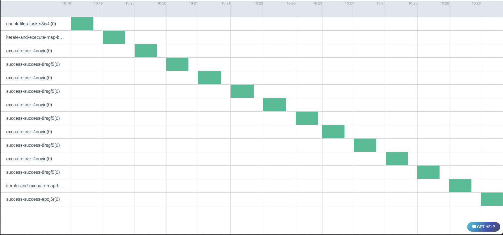

[Argo workflows](https://argo-workflows.readthedocs.io/en/latest/) is a powerful
container orchestration framework for Kubernetes and it can run on any Kubernetes environment.

**runnable** will transpile pipeline definition to argo specification during the pipeline execution which
you can then upload to the cluster either manually or via CICD (recommended).

- [x] Execute the pipeline in any cloud environment.
- [x] Massively scalable.
- [x] Ability to provide specialized compute environments for different steps of the pipeline.
- [ ] Expects a mature cloud kubernetes environment and expertise.

runnable provides *sensible* defaults to most of the configuration variables but it is highly advised
to get inputs from infrastructure teams or ML engineers in defining the configuration.


## Configuration

Only ```image``` is the required parameter. Please refer to the
[note on containers](container-environments.md) on building images.


```yaml linenums="1"
executor:
  type: argo
  config:
    name:
    annotations:
    labels:
    namespace:
    image: <required>
    pod_gc:
    max_workflow_duration_in_seconds:
    node_selector:
    parallelism:
    service_account_name:
    resources:
    retry_strategy:
    max_step_duration_in_seconds:
    tolerations:
    image_pull_policy:
    expose_parameters_as_inputs:
    output_file:
    secrets_from_k8s:
    persistent_volumes:
```


### Defaults


!!! warning "Default values"

    Ensure that these default values fit your needs to avoid unexpected behavior.

<div class="annotate" markdown>

| Parameter      | Default | Argo Field |
| :-----------: | :-------------: | :------------: |
| name | ```runnable-dag-``` | ```generateName``` |
| annotations | ```{}``` | ```annotations``` of ```metadata``` |
| labels | ```{}``` | ```labels``` |
| pod_gc       | ```OnPodCompletion```  | ```podGC``` |
| service_account_name | ```None``` | ```serviceAccountName``` of spec |
| secrets_from_k8s | ```[]``` | List
| expose_parameters_as_inputs | True | NA
| max_workflow_duration_in_seconds | 86400 seconds = 1 day | ```activeDeadlineSeconds``` of spec |
| node_selector | ```{}``` | ```nodeSelector``` |
| parallelism | ```None``` | ```parallelism``` of spec |
| resources | limits: 1Gi of memory and 250m of CPU | ```resources``` of the container |
| retry_strategy | ```None``` | ```retryStrategy``` of the spec |
| max_step_duration_in_seconds | 60 * 60 * 2 = 2 hours | ```activeDeadlineSeconds``` of container |
| tolerations | ```{}``` | ```tolerations``` of the container |
| image_pull_policy | ```"" ``` | ```imagePullPolicy``` of the container |
| persistent_volumes | ```None``` | '''


</div>

### Notes

#### The following parameters cannot be overridden at individual step level.

- ```name```: Using a name provides a logical way to organize pipelines.
- ```pod_gc```: Defines the pod garbage collection strategy. Setting to ```OnPodCompletion``` will mark the
pod for garbage collection immediately after completion, either success or failure.
- ```annotations```: [Unstructured key value pairs](http://kubernetes.io/docs/user-guide/annotations)
that can be added to K8's resources.
- ```labels```: Dictionary of labels to apply to all the objects of the workflow.
- ```service_account_name```: Name of the service account to be used to run the workflow.
- ```max_workflow_duration_in_seconds```: The default value is 1 day for the completion of the workflow. Kubernetes
will actively try to fail the pipeline after this duration.

!!! tip inline end "Volumes"

    As the persistent volumes are attached to the pod at specified path, it allows for ```file-system``` based
    catalog or run log store to work without any modifications.

    For example, ```/mnt``` folder can be used as the
    ```parent``` directory for file-system run log store and catalog.


- ```persistent_volumes```: Persistent volumes from the underlying Kubernetes cluster to be assigned to the pods.
You can attach multiple persistent volumes to the pods as long as there are no clashes with mount paths.

#### Example:


The following adds the volume ```runnable-volume``` to every container of the workflow at ```/mnt```

```yaml
persistent_volumes:
  - name: runnable-volume
    mount_path: /mnt
```

- ```secrets_from_k8s```: List of secrets from the Kubernetes cluster to be exposed as environment variables.

!!! tip inline end "Secrets"

    As the secrets are exposed as environment variables, the application can then be configured using
    ```env-secrets-manager``` as a convenient way to access K8's secrets.


#### Example:
In the example below, the secret ```connection_string``` from ```postgres``` secret of K8's is exposed as
```connection_string``` to the container.

```yaml
secrets_from_k8s:
  - environment_variable: connection_string
    secret_name: postgres
    secret_key: connection_string
```

- ```expose_parameters_as_inputs```: Expose parameters of simple python data types (str, int, float)
as inputs to the workflow. This allows for changing the parameters at runtime.

#### Example:


=== "Initial Parameters"

    Assumed to present at ```examples/concepts/parameters.yaml```

    ```yaml
    --8<-- "examples/concepts/parameters.yaml"
    ```


=== "pipeline"

    Execute the pipeline as:
    ```runnable execute -f examples/concepts/task_shell_parameters.yaml  -p examples/concepts/parameters.yaml -c examples/configs/argo-config.yaml```

    ```yaml linenums="1"
    --8<-- "examples/concepts/task_shell_parameters.yaml"
    ```

=== "argo workflow"

    The initial parameter of ```spam``` is exposed and defaulted to ```Hello``` as per the parameters file.
    The ```run_id``` is also a configurable run time parameter.

    ```yaml linenums="1" hl_lines="151-156"
    apiVersion: argoproj.io/v1alpha1
    kind: Workflow
    metadata:
      generateName: runnable-dag-
      annotations: {}
      labels: {}
    spec:
      activeDeadlineSeconds: 172800
      entrypoint: runnable-dag
      podGC:
        strategy: OnPodCompletion
      retryStrategy:
        limit: '0'
        retryPolicy: Always
        backoff:
          duration: '120'
          factor: 2
          maxDuration: '3600'
      serviceAccountName: default-editor
      templates:
        - name: runnable-dag
          failFast: true
          dag:
            tasks:
              - name: access-initial-task-cybkoa
                template: access-initial-task-cybkoa
                depends: ''
              - name: modify-initial-task-6lka8g
                template: modify-initial-task-6lka8g
                depends: access-initial-task-cybkoa.Succeeded
              - name: display-again-task-6d1ofy
                template: display-again-task-6d1ofy
                depends: modify-initial-task-6lka8g.Succeeded
              - name: success-success-igw6ct
                template: success-success-igw6ct
                depends: display-again-task-6d1ofy.Succeeded
        - name: access-initial-task-cybkoa
          container:
            image: harbor.csis.astrazeneca.net/mlops/runnable:latest
            command:
              - runnable
              - execute_single_node
              - '{{workflow.parameters.run_id}}'
              - access%initial
              - --log-level
              - WARNING
              - --file
              - examples/concepts/task_shell_parameters.yaml
              - --config-file
              - examples/configs/argo-config.yaml
              - --parameters-file
              - examples/concepts/parameters.yaml
            volumeMounts:
              - name: executor-0
                mountPath: /mnt
            imagePullPolicy: ''
            resources:
              limits:
                memory: 1Gi
                cpu: 250m
              requests:
                memory: 1Gi
                cpu: 250m
            env:
              - name: runnable_PRM_spam
                value: '{{workflow.parameters.spam}}'
        - name: modify-initial-task-6lka8g
          container:
            image: harbor.csis.astrazeneca.net/mlops/runnable:latest
            command:
              - runnable
              - execute_single_node
              - '{{workflow.parameters.run_id}}'
              - modify%initial
              - --log-level
              - WARNING
              - --file
              - examples/concepts/task_shell_parameters.yaml
              - --config-file
              - examples/configs/argo-config.yaml
              - --parameters-file
              - examples/concepts/parameters.yaml
            volumeMounts:
              - name: executor-0
                mountPath: /mnt
            imagePullPolicy: ''
            resources:
              limits:
                memory: 1Gi
                cpu: 250m
              requests:
                memory: 1Gi
                cpu: 250m
        - name: display-again-task-6d1ofy
          container:
            image: harbor.csis.astrazeneca.net/mlops/runnable:latest
            command:
              - runnable
              - execute_single_node
              - '{{workflow.parameters.run_id}}'
              - display%again
              - --log-level
              - WARNING
              - --file
              - examples/concepts/task_shell_parameters.yaml
              - --config-file
              - examples/configs/argo-config.yaml
              - --parameters-file
              - examples/concepts/parameters.yaml
            volumeMounts:
              - name: executor-0
                mountPath: /mnt
            imagePullPolicy: ''
            resources:
              limits:
                memory: 1Gi
                cpu: 250m
              requests:
                memory: 1Gi
                cpu: 250m
        - name: success-success-igw6ct
          container:
            image: harbor.csis.astrazeneca.net/mlops/runnable:latest
            command:
              - runnable
              - execute_single_node
              - '{{workflow.parameters.run_id}}'
              - success
              - --log-level
              - WARNING
              - --file
              - examples/concepts/task_shell_parameters.yaml
              - --config-file
              - examples/configs/argo-config.yaml
              - --parameters-file
              - examples/concepts/parameters.yaml
            volumeMounts:
              - name: executor-0
                mountPath: /mnt
            imagePullPolicy: ''
            resources:
              limits:
                memory: 1Gi
                cpu: 250m
              requests:
                memory: 1Gi
                cpu: 250m
      templateDefaults:
        activeDeadlineSeconds: 7200
        timeout: 10800s
      arguments:
        parameters:
          - name: spam
            value: Hello
          - name: run_id
            value: '{{workflow.uid}}'
      volumes:
        - name: executor-0
          persistentVolumeClaim:
            claimName: runnable-volume

    ```


=== "Run Submission"

    <figure markdown>
        { width="800" height="600"}
        <figcaption>argo workflows UI exposing the parameters</figcaption>
    </figure>


=== "Step Log"

    The ```step log``` of the first step, ```access initial``` receives the value of the parameter ```spam``` as
    ```No-Hello``` from the UI submission.


    ```json linenums="1" hl_lines="25-30"
    {
      "name": "access initial",
      "internal_name": "access initial",
      "status": "SUCCESS",
      "step_type": "task",
      "message": "",
      "mock": false,
      "code_identities": [
          {
              "code_identifier": "39cd98770cb2fd6994d8ac08ae4c5506e5ce694a",
              "code_identifier_type": "git",
              "code_identifier_dependable": true,
              "code_identifier_url": "https://github.com/AstraZeneca/runnable-core.git",
              "code_identifier_message": ""
          }
      ],
      "attempts": [
          {
              "attempt_number": 1,
              "start_time": "2024-02-01 14:44:06.023052",
              "end_time": "2024-02-01 14:44:06.031187",
              "duration": "0:00:00.008135",
              "status": "SUCCESS",
              "message": "",
              "parameters": {
                  "spam": "No-Hello",
                  "eggs": {
                      "ham": "Yes, please!!"
                  }
              }
          }
      ],
      "user_defined_metrics": {},
      "branches": {},
      "data_catalog": []
    }
    ```


#### The following parameters can be configured at step level using overrides:

- parallelism: Controls the number of parallel tasks that can happen at once. By default,
there is no limit either for ```parallel``` or ```map``` nodes.
To control the parallelism of a ```map``` or ```parallel```, provide an ```override```
in the overrides section.

The parallelism constraint [only applies to the step](https://github.com/argoproj/argo-workflows/blob/main/examples/parallelism-nested.yaml), any nested steps within the step have the ```default``` parallelism.


#### Example:


=== "Without Override"

    By default, there is no limit on the number of parallel tasks that can be run.

    === "Configuration"

        The argo config is a very basic configuration.

        ```yaml linenums="1"
        --8<-- "examples/configs/argo-config.yaml"
        ```

    === "Pipeline"

        This example is the same as [detailed in map](../../concepts/map.md).

        ```yaml linenums="1" hl_lines="22-23 25-36"
        --8<-- "examples/concepts/map.yaml"
        ```

    === "Workflow execution"

        From the ```gant``` chart representation of the workflow execution, we can see that all the ```execute_task```
        tasks execute simultaneously.

        <figure markdown>
          { width="800" height="600"}
          <figcaption>argo workflows UI exposing the parameters</figcaption>
        </figure>


=== "With Override"

    === "Configuration"

        While the global configuration has no limit on parallelism, any task using ```sequential``` override would
        run sequentially.

        ```yaml linenums="1" hl_lines="9-11"
        --8<-- "examples/configs/argo-config-sequential.yaml"
        ```


    === "Pipeline"

        The pipeline defined here is nearly the same as [detailed in map](../../concepts/map.md) with the
        only exception in lines 25-26 which use the ```sequential``` override.

        ```yaml linenums="1" hl_lines="22-23 25-36"
        --8<-- "examples/executors/argo-map-sequential.yaml"
        ```


    === "Workflow execution"

        The workflow execution from the ```gant``` chart shows the execution of ```execute task``` is sequential
        instead of parallel as seen in the default.

        <figure markdown>
          { width="800" height="600"}
          <figcaption>argo workflows UI exposing the parameters</figcaption>
        </figure>


- ```node_selector``` and ```tolerations```: Gives you the ability to selectively choose a node to run your task.
See more information about [node selector](https://kubernetes.io/docs/tasks/configure-pod-container/assign-pods-nodes/)
and [tolerations](https://kubernetes.io/docs/concepts/scheduling-eviction/taint-and-toleration/) for more information.


- resources: Has the [same structure as K8's manifest](https://kubernetes.io/docs/concepts/configuration/manage-resources-containers/). To use a GPU, you can mention the maximum number of GPUs in ```limits``` section.
The default value is 1Gi of memory and 250m of cpu with no GPU. To override the resources for a specific task,
use ```overrides``` section.

Example:

=== "Configuration"
    ```yaml title="Argo configuration with override"
    executor:
    type: argo
    config:
        image: <required>
    overrides:
        BiggerMachine:
          requests:
            memory: 4Gi
            cpu: 4
    ```

=== "pipeline"

    In this example, the ```run on bigger machine``` will run on a node that can provide 4 CPU cores and 4GB memory.

    ```yaml
    dag:
      steps:
        run on bigger machine:
          type: task
          override:
            argo: BiggerMachine

    ```


- ```max_step_duration_in_seconds```: Defines the maximum
[amount of time](https://argo-workflows.readthedocs.io/en/latest/walk-through/timeouts/) a task can
take for completion. The default value is 2 hours and an additional 1 hour is given for ```timeout```.

- ```retry_strategy```: Defines the strategy to retry in case of failure. The default retry policy is ```Always```,
i.e in case of failure in execution of task or any other infrastructure failures. Please see
[argo workflows documentation](https://argo-workflows.readthedocs.io/en/latest/walk-through/retrying-failed-or-errored-steps/)
for more information. As with other parameters, this can be overridden for individual task nodes.

- ```image_pull_policy```: Defaults to not setting the field. This behavior does not pull the image for any tag
[other than ```latest```](https://kubernetes.io/docs/concepts/containers/images/#imagepullpolicy-defaulting)


## Compatibility

As argo workflows is a cloud based executor, not all the services are compatible with it.

- Run log: All steps of the workflow need access to the run log as such ```buffered``` run log
store would not be compatible. ```file-system``` based run log store is compatible by
using volumes that are available for all the steps of the workflow, eg. persistent volumes.

- catalog: Any catalog service that is available for all the steps of the workflow is compatible.
```file-system``` is compatible as long as the catalog store is mounted as a volume similar to the run log store.

- secrets: It is possible to use ```dotenv``` secrets manager as long as the file is available
during the execution of the task. We highly recommend ```.env``` files to be excluded from the
code versioning tools. We recommend using ```secrets_from_k8s``` in the configuration.


## Example


=== "configuration"

    Assumed to be present at ```examples/configs/argo-config.yaml```

    The docker image is a [variable](container-environments.md/#dynamic_name_of_the_image) and
    dynamically set during execution.

    ```yaml linenums="1" hl_lines="4"
    --8<-- "examples/configs/argo-config.yaml"
    ```

    1. Use ```argo``` executor type to execute the pipeline.
    2. By default, all the tasks are executed in the docker image . Please
    refer to [building docker images](container-environments.md)
    3. Mount the persistent volume ```runnable-volume``` to all the containers as ```/mnt```.
    4. Store the run logs in the file-system. As all containers have access to ```runnable-volume```
    as ```/mnt```. We use that to mounted folder as run log store.


=== "python SDK"

    Running the SDK defined pipelines for any container based executions [happens in
    multi-stage process](container-environments.md).

    1. Generate the ```yaml``` definition file by:
    ```runnable_CONFIGURATION_FILE=examples/configs/argo-config.yaml python examples/concepts/simple.py```
    2. Build the docker image with yaml definition in it, called runnable:latest in current example.
    3. Execute the pipeline via the runnable CLI,
    ```runnable_VAR_argo_docker_image=runnable:latest  runnable execute -f runnable-pipeline.yaml -c examples/configs/argo-config.yaml```


    ```python linenums="1" hl_lines="24"
    --8<-- "examples/concepts/simple.py"
    ```

    1. You can provide a configuration file dynamically by using the environment
    variable ```runnable_CONFIGURATION_FILE```. Please see [SDK for more details](../../sdk.md).


=== "yaml"

    For yaml based definitions, the execution order is to:

    1. Build the docker image with the yaml definition in it, called runnable:latest in current example.
    2. Execute the pipeline via the runnable CLI:
    ```runnable_VAR_argo_docker_image=runnable:latest runnable execute -f examples/concepts/simple.yaml -c examples/configs/argo-config.yaml```

    ```yaml linenums="1"
    --8<-- "examples/concepts/simple.yaml"
    ```

=== "Argo workflow definition"

    ```yaml linenums="1"
    --8<-- "examples/configs/argo-pipeline.yaml"
    ```

=== "Screenshots"

    <figure markdown>
        { width="800" height="600"}
        <figcaption>argo workflows UI showing the pipeline</figcaption>
    </figure>

    <figure markdown>
        { width="800" height="600"}
        <figcaption>argo workflows UI showing the logs</figcaption>
    </figure>


=== "Run Log"

    The run log structure is the same as any other executor. Any failed executions in the
    workflow can be executed in ```local``` by providing this run log and any catalog files.

    ```json
    {
      "run_id": "bb96359d-74f0-4837-90e3-94aed85dbb8f",
      "dag_hash": "d467805d7f743d459a6abce95bedbfc6c1ecab67",
      "use_cached": false,
      "tag": "",
      "original_run_id": "",
      "status": "SUCCESS",
      "steps": {
          "simple": {
              "name": "simple",
              "internal_name": "simple",
              "status": "SUCCESS",
              "step_type": "task",
              "message": "",
              "mock": false,
              "code_identities": [
                  {
                      "code_identifier": "39cd98770cb2fd6994d8ac08ae4c5506e5ce694a",
                      "code_identifier_type": "git",
                      "code_identifier_dependable": true,
                      "code_identifier_url": "https://github.com/AstraZeneca/runnable-core.git",
                      "code_identifier_message": ""
                  }
              ],
              "attempts": [
                  {
                      "attempt_number": 1,
                      "start_time": "2024-01-31 06:43:01.937309",
                      "end_time": "2024-01-31 06:43:01.940862",
                      "duration": "0:00:00.003553",
                      "status": "SUCCESS",
                      "message": "",
                      "parameters": {}
                  }
              ],
              "user_defined_metrics": {},
              "branches": {},
              "data_catalog": []
          },
          "success": {
              "name": "success",
              "internal_name": "success",
              "status": "SUCCESS",
              "step_type": "success",
              "message": "",
              "mock": false,
              "code_identities": [
                  {
                      "code_identifier": "39cd98770cb2fd6994d8ac08ae4c5506e5ce694a",
                      "code_identifier_type": "git",
                      "code_identifier_dependable": false,
                      "code_identifier_url": "https://github.com/AstraZeneca/runnable-core.git",
                      "code_identifier_message": ""
                  }
              ],
              "attempts": [
                  {
                      "attempt_number": 1,
                      "start_time": "2024-01-31 06:43:26.537710",
                      "end_time": "2024-01-31 06:43:26.544461",
                      "duration": "0:00:00.006751",
                      "status": "SUCCESS",
                      "message": "",
                      "parameters": {}
                  }
              ],
              "user_defined_metrics": {},
              "branches": {},
              "data_catalog": []
          }
      },
      "parameters": {},
      "run_config": {
          "executor": {
              "service_name": "argo",
              "service_type": "executor",
              "enable_parallel": false,
              "overrides": {},
              "image": "$argo_docker_image",
              "expose_parameters_as_inputs": true,
              "output_file": "argo-pipeline.yaml",
              "name": "runnable-dag-",
              "annotations": {},
              "labels": {},
              "namespace": null,
              "activeDeadlineSeconds": 172800,
              "nodeSelector": null,
              "parallelism": null,
              "branch_parallelism": 0,
              "retryStrategy": {
                  "limit": "0",
                  "retryPolicy": "Always",
                  "backoff": {
                      "duration": "120",
                      "factor": 2,
                      "maxDuration": "3600"
                  }
              },
              "max_step_duration_in_seconds": 7200,
              "tolerations": null,
              "image_pull_policy": "",
              "service_account_name": null,
              "secrets_from_k8s": [],
              "persistent_volumes": [
                  {
                      "name": "runnable-volume",
                      "mount_path": "/mnt"
                  }
              ],
              "step_timeout": 14400
          },
          "run_log_store": {
              "service_name": "file-system",
              "service_type": "run_log_store",
              "log_folder": "/mnt/run_log_store"
          },
          "secrets_handler": {
              "service_name": "do-nothing",
              "service_type": "secrets"
          },
          "catalog_handler": {
              "service_name": "do-nothing",
              "service_type": "catalog"
          },
          "experiment_tracker": {
              "service_name": "do-nothing",
              "service_type": "experiment_tracker"
          },
          "pipeline_file": "examples/concepts/simple.yaml",
          "parameters_file": null,
          "configuration_file": "examples/configs/argo-config.yaml",
          "tag": "",
          "run_id": "bb96359d-74f0-4837-90e3-94aed85dbb8f",
          "variables": {},
          "use_cached": false,
          "original_run_id": "",
          "dag": {
              "start_at": "simple",
              "name": "",
              "description": null,
              "steps": {
                  "simple": {
                      "type": "task",
                      "name": "simple",
                      "next": "success",
                      "on_failure": "",
                      "overrides": {},
                      "catalog": null,
                      "max_attempts": 1,
                      "command": "examples.concepts.simple.simple_function",
                      "command_type": "python",
                      "node_name": "simple"
                  },
                  "success": {
                      "type": "success",
                      "name": "success"
                  },
                  "fail": {
                      "type": "fail",
                      "name": "fail"
                  }
              }
          },
          "dag_hash": "d467805d7f743d459a6abce95bedbfc6c1ecab67",
          "execution_plan": "chained"
      }
    }
    ```


## Nesting

runnable compiled argo workflows support deeply nested workflows.

### Example

=== "Nested workflow"

    This is the same example as shown in [nested](../../concepts/nesting.md).

    ```yaml linenums="1"
    --8<-- "examples/concepts/nesting.yaml"
    ```


=== "Configuration"

    Assumed to be present at ```examples/configs/argo-config.yaml```

    The docker image is a [variable](container-environments.md) and
    dynamically set during execution.

    ```yaml linenums="1" hl_lines="4"
    --8<-- "examples/configs/argo-config.yaml"
    ```

    1. Use ```argo``` executor type to execute the pipeline.
    2. By default, all the tasks are executed in the docker image . Please
    refer to [building docker images](container-environments.md)
    3. Mount the persistent volume ```runnable-volume``` to all the containers as ```/mnt```.
    4. Store the run logs in the file-system. As all containers have access to ```runnable-volume```
    as ```/mnt```. We use that to mounted folder as run log store.


=== "Argo workflow"

    ```yaml linenums="1"
    apiVersion: argoproj.io/v1alpha1
    kind: Workflow
    metadata:
      generateName: runnable-dag-
      annotations: {}
      labels: {}
    spec:
      activeDeadlineSeconds: 172800
      entrypoint: runnable-dag
      retryStrategy:
        limit: "0"
        retryPolicy: Always
        backoff:
          duration: "120"
          factor: 2
          maxDuration: "3600"
      serviceAccountName: default-editor
      templates:
        - name: inner-most-map-map-yeslqe-map
          inputs:
            parameters:
              - name: xarg
              - name: yarg
          failFast: true
          dag:
            tasks:
              - name: executable-stub-blnf25
                template: executable-stub-blnf25
                depends: ""
                arguments:
                  parameters:
                    - name: xarg
                      value: "{{inputs.parameters.xarg}}"
                    - name: yarg
                      value: "{{inputs.parameters.yarg}}"
              - name: success-success-trvgst
                template: success-success-trvgst
                depends: executable-stub-blnf25.Succeeded
                arguments:
                  parameters:
                    - name: xarg
                      value: "{{inputs.parameters.xarg}}"
                    - name: yarg
                      value: "{{inputs.parameters.yarg}}"
        - name: inner-most-map-map-yeslqe
          inputs:
            parameters:
              - name: xarg
          failFast: true
          dag:
            tasks:
              - name: inner-most-map-map-yeslqe-fan-out
                template: inner-most-map-map-yeslqe-fan-out
                depends: ""
                arguments:
                  parameters:
                    - name: xarg
                      value: "{{inputs.parameters.xarg}}"
              - name: inner-most-map-map-yeslqe-map
                template: inner-most-map-map-yeslqe-map
                depends: inner-most-map-map-yeslqe-fan-out.Succeeded
                arguments:
                  parameters:
                    - name: xarg
                      value: "{{inputs.parameters.xarg}}"
                    - name: yarg
                      value: "{{item}}"
                withParam: "{{tasks.inner-most-map-map-yeslqe-fan-out.outputs.parameters.iterate-on}}"
              - name: inner-most-map-map-yeslqe-fan-in
                template: inner-most-map-map-yeslqe-fan-in
                depends: inner-most-map-map-yeslqe-map.Succeeded || inner-most-map-map-yeslqe-map.Failed
                arguments:
                  parameters:
                    - name: xarg
                      value: "{{inputs.parameters.xarg}}"
        - name: nested-parallel-parallel-wje1o4-outer-most-map-map-variable-placeholder-nested-parallel-a
          inputs:
            parameters:
              - name: xarg
          failFast: true
          dag:
            tasks:
              - name: inner-most-map-map-yeslqe
                template: inner-most-map-map-yeslqe
                depends: ""
                arguments:
                  parameters:
                    - name: xarg
                      value: "{{inputs.parameters.xarg}}"
              - name: success-success-y1yr7v
                template: success-success-y1yr7v
                depends: inner-most-map-map-yeslqe.Succeeded
                arguments:
                  parameters:
                    - name: xarg
                      value: "{{inputs.parameters.xarg}}"
        - name: inner-most-map-map-b206p5-map
          inputs:
            parameters:
              - name: xarg
              - name: yarg
          failFast: true
          dag:
            tasks:
              - name: executable-stub-8ui1yv
                template: executable-stub-8ui1yv
                depends: ""
                arguments:
                  parameters:
                    - name: xarg
                      value: "{{inputs.parameters.xarg}}"
                    - name: yarg
                      value: "{{inputs.parameters.yarg}}"
              - name: success-success-h4j0k9
                template: success-success-h4j0k9
                depends: executable-stub-8ui1yv.Succeeded
                arguments:
                  parameters:
                    - name: xarg
                      value: "{{inputs.parameters.xarg}}"
                    - name: yarg
                      value: "{{inputs.parameters.yarg}}"
        - name: inner-most-map-map-b206p5
          inputs:
            parameters:
              - name: xarg
          failFast: true
          dag:
            tasks:
              - name: inner-most-map-map-b206p5-fan-out
                template: inner-most-map-map-b206p5-fan-out
                depends: ""
                arguments:
                  parameters:
                    - name: xarg
                      value: "{{inputs.parameters.xarg}}"
              - name: inner-most-map-map-b206p5-map
                template: inner-most-map-map-b206p5-map
                depends: inner-most-map-map-b206p5-fan-out.Succeeded
                arguments:
                  parameters:
                    - name: xarg
                      value: "{{inputs.parameters.xarg}}"
                    - name: yarg
                      value: "{{item}}"
                withParam: "{{tasks.inner-most-map-map-b206p5-fan-out.outputs.parameters.iterate-on}}"
              - name: inner-most-map-map-b206p5-fan-in
                template: inner-most-map-map-b206p5-fan-in
                depends: inner-most-map-map-b206p5-map.Succeeded || inner-most-map-map-b206p5-map.Failed
                arguments:
                  parameters:
                    - name: xarg
                      value: "{{inputs.parameters.xarg}}"
        - name: nested-parallel-parallel-wje1o4-outer-most-map-map-variable-placeholder-nested-parallel-b
          inputs:
            parameters:
              - name: xarg
          failFast: true
          dag:
            tasks:
              - name: inner-most-map-map-b206p5
                template: inner-most-map-map-b206p5
                depends: ""
                arguments:
                  parameters:
                    - name: xarg
                      value: "{{inputs.parameters.xarg}}"
              - name: success-success-dvma7h
                template: success-success-dvma7h
                depends: inner-most-map-map-b206p5.Succeeded
                arguments:
                  parameters:
                    - name: xarg
                      value: "{{inputs.parameters.xarg}}"
        - name: nested-parallel-parallel-wje1o4
          inputs:
            parameters:
              - name: xarg
          failFast: true
          dag:
            tasks:
              - name: nested-parallel-parallel-wje1o4-fan-out
                template: nested-parallel-parallel-wje1o4-fan-out
                depends: ""
                arguments:
                  parameters:
                    - name: xarg
                      value: "{{inputs.parameters.xarg}}"
              - name: nested-parallel-parallel-wje1o4-outer-most-map-map-variable-placeholder-nested-parallel-a
                template: nested-parallel-parallel-wje1o4-outer-most-map-map-variable-placeholder-nested-parallel-a
                depends: nested-parallel-parallel-wje1o4-fan-out.Succeeded
                arguments:
                  parameters:
                    - name: xarg
                      value: "{{inputs.parameters.xarg}}"
              - name: nested-parallel-parallel-wje1o4-outer-most-map-map-variable-placeholder-nested-parallel-b
                template: nested-parallel-parallel-wje1o4-outer-most-map-map-variable-placeholder-nested-parallel-b
                depends: nested-parallel-parallel-wje1o4-fan-out.Succeeded
                arguments:
                  parameters:
                    - name: xarg
                      value: "{{inputs.parameters.xarg}}"
              - name: nested-parallel-parallel-wje1o4-fan-in
                template: nested-parallel-parallel-wje1o4-fan-in
                depends:
                  nested-parallel-parallel-wje1o4-outer-most-map-map-variable-placeholder-nested-parallel-a.Succeeded
                  ||
                  nested-parallel-parallel-wje1o4-outer-most-map-map-variable-placeholder-nested-parallel-a.Failed
                  ||
                  nested-parallel-parallel-wje1o4-outer-most-map-map-variable-placeholder-nested-parallel-b.Succeeded
                  ||
                  nested-parallel-parallel-wje1o4-outer-most-map-map-variable-placeholder-nested-parallel-b.Failed
                arguments:
                  parameters:
                    - name: xarg
                      value: "{{inputs.parameters.xarg}}"
        - name: outer-most-map-map-0ukhr5-map
          inputs:
            parameters:
              - name: xarg
          failFast: true
          dag:
            tasks:
              - name: nested-parallel-parallel-wje1o4
                template: nested-parallel-parallel-wje1o4
                depends: ""
                arguments:
                  parameters:
                    - name: xarg
                      value: "{{inputs.parameters.xarg}}"
              - name: success-success-e4lb2k
                template: success-success-e4lb2k
                depends: nested-parallel-parallel-wje1o4.Succeeded
                arguments:
                  parameters:
                    - name: xarg
                      value: "{{inputs.parameters.xarg}}"
        - name: outer-most-map-map-0ukhr5
          failFast: true
          dag:
            tasks:
              - name: outer-most-map-map-0ukhr5-fan-out
                template: outer-most-map-map-0ukhr5-fan-out
                depends: ""
              - name: outer-most-map-map-0ukhr5-map
                template: outer-most-map-map-0ukhr5-map
                depends: outer-most-map-map-0ukhr5-fan-out.Succeeded
                arguments:
                  parameters:
                    - name: xarg
                      value: "{{item}}"
                withParam: "{{tasks.outer-most-map-map-0ukhr5-fan-out.outputs.parameters.iterate-on}}"
              - name: outer-most-map-map-0ukhr5-fan-in
                template: outer-most-map-map-0ukhr5-fan-in
                depends: outer-most-map-map-0ukhr5-map.Succeeded || outer-most-map-map-0ukhr5-map.Failed
        - name: runnable-dag
          failFast: true
          dag:
            tasks:
              - name: generate-list-task-s7za4e
                template: generate-list-task-s7za4e
                depends: ""
              - name: outer-most-map-map-0ukhr5
                template: outer-most-map-map-0ukhr5
                depends: generate-list-task-s7za4e.Succeeded
              - name: success-success-2v62uq
                template: success-success-2v62uq
                depends: outer-most-map-map-0ukhr5.Succeeded
        - name: generate-list-task-s7za4e
          container:
            image: harbor.csis.astrazeneca.net/mlops/runnable:latest
            command:
              - runnable
              - execute_single_node
              - "{{workflow.parameters.run_id}}"
              - generate_list
              - --log-level
              - WARNING
              - --file
              - examples/concepts/nesting.yaml
              - --config-file
              - examples/configs/argo-config.yaml
            volumeMounts:
              - name: executor-0
                mountPath: /mnt
            imagePullPolicy: ""
            resources:
              limits:
                memory: 1Gi
                cpu: 250m
              requests:
                memory: 1Gi
                cpu: 250m
        - name: outer-most-map-map-0ukhr5-fan-out
          container:
            image: harbor.csis.astrazeneca.net/mlops/runnable:latest
            command:
              - runnable
              - fan
              - "{{workflow.parameters.run_id}}"
              - outer%most%map
              - --mode
              - out
              - --file
              - examples/concepts/nesting.yaml
              - --log-level
              - WARNING
              - --config-file
              - examples/configs/argo-config.yaml
            volumeMounts:
              - name: executor-0
                mountPath: /mnt
            imagePullPolicy: ""
            resources:
              limits:
                memory: 1Gi
                cpu: 250m
              requests:
                memory: 1Gi
                cpu: 250m
          outputs:
            parameters:
              - name: iterate-on
                valueFrom:
                  path: /tmp/output.txt
        - name: outer-most-map-map-0ukhr5-fan-in
          container:
            image: harbor.csis.astrazeneca.net/mlops/runnable:latest
            command:
              - runnable
              - fan
              - "{{workflow.parameters.run_id}}"
              - outer%most%map
              - --mode
              - in
              - --file
              - examples/concepts/nesting.yaml
              - --log-level
              - WARNING
              - --config-file
              - examples/configs/argo-config.yaml
            volumeMounts:
              - name: executor-0
                mountPath: /mnt
            imagePullPolicy: ""
            resources:
              limits:
                memory: 1Gi
                cpu: 250m
              requests:
                memory: 1Gi
                cpu: 250m
        - name: nested-parallel-parallel-wje1o4-fan-out
          container:
            image: harbor.csis.astrazeneca.net/mlops/runnable:latest
            command:
              - runnable
              - fan
              - "{{workflow.parameters.run_id}}"
              - outer%most%map.map_variable_placeholder.nested%parallel
              - --mode
              - out
              - --file
              - examples/concepts/nesting.yaml
              - --log-level
              - WARNING
              - --config-file
              - examples/configs/argo-config.yaml
              - --map-variable
              - '{"xarg": "{{inputs.parameters.xarg}}"}'
            volumeMounts:
              - name: executor-0
                mountPath: /mnt
            imagePullPolicy: ""
            resources:
              limits:
                memory: 1Gi
                cpu: 250m
              requests:
                memory: 1Gi
                cpu: 250m
          inputs:
            parameters:
              - name: xarg
        - name: nested-parallel-parallel-wje1o4-fan-in
          container:
            image: harbor.csis.astrazeneca.net/mlops/runnable:latest
            command:
              - runnable
              - fan
              - "{{workflow.parameters.run_id}}"
              - outer%most%map.map_variable_placeholder.nested%parallel
              - --mode
              - in
              - --file
              - examples/concepts/nesting.yaml
              - --log-level
              - WARNING
              - --config-file
              - examples/configs/argo-config.yaml
              - --map-variable
              - '{"xarg": "{{inputs.parameters.xarg}}"}'
            volumeMounts:
              - name: executor-0
                mountPath: /mnt
            imagePullPolicy: ""
            resources:
              limits:
                memory: 1Gi
                cpu: 250m
              requests:
                memory: 1Gi
                cpu: 250m
          inputs:
            parameters:
              - name: xarg
        - name: inner-most-map-map-yeslqe-fan-out
          container:
            image: harbor.csis.astrazeneca.net/mlops/runnable:latest
            command:
              - runnable
              - fan
              - "{{workflow.parameters.run_id}}"
              - outer%most%map.map_variable_placeholder.nested%parallel.a.inner%most%map
              - --mode
              - out
              - --file
              - examples/concepts/nesting.yaml
              - --log-level
              - WARNING
              - --config-file
              - examples/configs/argo-config.yaml
              - --map-variable
              - '{"xarg": "{{inputs.parameters.xarg}}"}'
            volumeMounts:
              - name: executor-0
                mountPath: /mnt
            imagePullPolicy: ""
            resources:
              limits:
                memory: 1Gi
                cpu: 250m
              requests:
                memory: 1Gi
                cpu: 250m
          outputs:
            parameters:
              - name: iterate-on
                valueFrom:
                  path: /tmp/output.txt
          inputs:
            parameters:
              - name: xarg
        - name: inner-most-map-map-yeslqe-fan-in
          container:
            image: harbor.csis.astrazeneca.net/mlops/runnable:latest
            command:
              - runnable
              - fan
              - "{{workflow.parameters.run_id}}"
              - outer%most%map.map_variable_placeholder.nested%parallel.a.inner%most%map
              - --mode
              - in
              - --file
              - examples/concepts/nesting.yaml
              - --log-level
              - WARNING
              - --config-file
              - examples/configs/argo-config.yaml
              - --map-variable
              - '{"xarg": "{{inputs.parameters.xarg}}"}'
            volumeMounts:
              - name: executor-0
                mountPath: /mnt
            imagePullPolicy: ""
            resources:
              limits:
                memory: 1Gi
                cpu: 250m
              requests:
                memory: 1Gi
                cpu: 250m
          inputs:
            parameters:
              - name: xarg
        - name: executable-stub-blnf25
          container:
            image: harbor.csis.astrazeneca.net/mlops/runnable:latest
            command:
              - runnable
              - execute_single_node
              - "{{workflow.parameters.run_id}}"
              - outer%most%map.map_variable_placeholder.nested%parallel.a.inner%most%map.map_variable_placeholder.executable
              - --log-level
              - WARNING
              - --file
              - examples/concepts/nesting.yaml
              - --map-variable
              - '{"xarg": "{{inputs.parameters.xarg}}", "yarg": "{{inputs.parameters.yarg}}"}'
              - --config-file
              - examples/configs/argo-config.yaml
            volumeMounts:
              - name: executor-0
                mountPath: /mnt
            imagePullPolicy: ""
            resources:
              limits:
                memory: 1Gi
                cpu: 250m
              requests:
                memory: 1Gi
                cpu: 250m
          inputs:
            parameters:
              - name: xarg
              - name: yarg
        - name: success-success-trvgst
          container:
            image: harbor.csis.astrazeneca.net/mlops/runnable:latest
            command:
              - runnable
              - execute_single_node
              - "{{workflow.parameters.run_id}}"
              - outer%most%map.map_variable_placeholder.nested%parallel.a.inner%most%map.map_variable_placeholder.success
              - --log-level
              - WARNING
              - --file
              - examples/concepts/nesting.yaml
              - --map-variable
              - '{"xarg": "{{inputs.parameters.xarg}}", "yarg": "{{inputs.parameters.yarg}}"}'
              - --config-file
              - examples/configs/argo-config.yaml
            volumeMounts:
              - name: executor-0
                mountPath: /mnt
            imagePullPolicy: ""
            resources:
              limits:
                memory: 1Gi
                cpu: 250m
              requests:
                memory: 1Gi
                cpu: 250m
          inputs:
            parameters:
              - name: xarg
              - name: yarg
        - name: success-success-y1yr7v
          container:
            image: harbor.csis.astrazeneca.net/mlops/runnable:latest
            command:
              - runnable
              - execute_single_node
              - "{{workflow.parameters.run_id}}"
              - outer%most%map.map_variable_placeholder.nested%parallel.a.success
              - --log-level
              - WARNING
              - --file
              - examples/concepts/nesting.yaml
              - --map-variable
              - '{"xarg": "{{inputs.parameters.xarg}}"}'
              - --config-file
              - examples/configs/argo-config.yaml
            volumeMounts:
              - name: executor-0
                mountPath: /mnt
            imagePullPolicy: ""
            resources:
              limits:
                memory: 1Gi
                cpu: 250m
              requests:
                memory: 1Gi
                cpu: 250m
          inputs:
            parameters:
              - name: xarg
        - name: inner-most-map-map-b206p5-fan-out
          container:
            image: harbor.csis.astrazeneca.net/mlops/runnable:latest
            command:
              - runnable
              - fan
              - "{{workflow.parameters.run_id}}"
              - outer%most%map.map_variable_placeholder.nested%parallel.b.inner%most%map
              - --mode
              - out
              - --file
              - examples/concepts/nesting.yaml
              - --log-level
              - WARNING
              - --config-file
              - examples/configs/argo-config.yaml
              - --map-variable
              - '{"xarg": "{{inputs.parameters.xarg}}"}'
            volumeMounts:
              - name: executor-0
                mountPath: /mnt
            imagePullPolicy: ""
            resources:
              limits:
                memory: 1Gi
                cpu: 250m
              requests:
                memory: 1Gi
                cpu: 250m
          outputs:
            parameters:
              - name: iterate-on
                valueFrom:
                  path: /tmp/output.txt
          inputs:
            parameters:
              - name: xarg
        - name: inner-most-map-map-b206p5-fan-in
          container:
            image: harbor.csis.astrazeneca.net/mlops/runnable:latest
            command:
              - runnable
              - fan
              - "{{workflow.parameters.run_id}}"
              - outer%most%map.map_variable_placeholder.nested%parallel.b.inner%most%map
              - --mode
              - in
              - --file
              - examples/concepts/nesting.yaml
              - --log-level
              - WARNING
              - --config-file
              - examples/configs/argo-config.yaml
              - --map-variable
              - '{"xarg": "{{inputs.parameters.xarg}}"}'
            volumeMounts:
              - name: executor-0
                mountPath: /mnt
            imagePullPolicy: ""
            resources:
              limits:
                memory: 1Gi
                cpu: 250m
              requests:
                memory: 1Gi
                cpu: 250m
          inputs:
            parameters:
              - name: xarg
        - name: executable-stub-8ui1yv
          container:
            image: harbor.csis.astrazeneca.net/mlops/runnable:latest
            command:
              - runnable
              - execute_single_node
              - "{{workflow.parameters.run_id}}"
              - outer%most%map.map_variable_placeholder.nested%parallel.b.inner%most%map.map_variable_placeholder.executable
              - --log-level
              - WARNING
              - --file
              - examples/concepts/nesting.yaml
              - --map-variable
              - '{"xarg": "{{inputs.parameters.xarg}}", "yarg": "{{inputs.parameters.yarg}}"}'
              - --config-file
              - examples/configs/argo-config.yaml
            volumeMounts:
              - name: executor-0
                mountPath: /mnt
            imagePullPolicy: ""
            resources:
              limits:
                memory: 1Gi
                cpu: 250m
              requests:
                memory: 1Gi
                cpu: 250m
          inputs:
            parameters:
              - name: xarg
              - name: yarg
        - name: success-success-h4j0k9
          container:
            image: harbor.csis.astrazeneca.net/mlops/runnable:latest
            command:
              - runnable
              - execute_single_node
              - "{{workflow.parameters.run_id}}"
              - outer%most%map.map_variable_placeholder.nested%parallel.b.inner%most%map.map_variable_placeholder.success
              - --log-level
              - WARNING
              - --file
              - examples/concepts/nesting.yaml
              - --map-variable
              - '{"xarg": "{{inputs.parameters.xarg}}", "yarg": "{{inputs.parameters.yarg}}"}'
              - --config-file
              - examples/configs/argo-config.yaml
            volumeMounts:
              - name: executor-0
                mountPath: /mnt
            imagePullPolicy: ""
            resources:
              limits:
                memory: 1Gi
                cpu: 250m
              requests:
                memory: 1Gi
                cpu: 250m
          inputs:
            parameters:
              - name: xarg
              - name: yarg
        - name: success-success-dvma7h
          container:
            image: harbor.csis.astrazeneca.net/mlops/runnable:latest
            command:
              - runnable
              - execute_single_node
              - "{{workflow.parameters.run_id}}"
              - outer%most%map.map_variable_placeholder.nested%parallel.b.success
              - --log-level
              - WARNING
              - --file
              - examples/concepts/nesting.yaml
              - --map-variable
              - '{"xarg": "{{inputs.parameters.xarg}}"}'
              - --config-file
              - examples/configs/argo-config.yaml
            volumeMounts:
              - name: executor-0
                mountPath: /mnt
            imagePullPolicy: ""
            resources:
              limits:
                memory: 1Gi
                cpu: 250m
              requests:
                memory: 1Gi
                cpu: 250m
          inputs:
            parameters:
              - name: xarg
        - name: success-success-e4lb2k
          container:
            image: harbor.csis.astrazeneca.net/mlops/runnable:latest
            command:
              - runnable
              - execute_single_node
              - "{{workflow.parameters.run_id}}"
              - outer%most%map.map_variable_placeholder.success
              - --log-level
              - WARNING
              - --file
              - examples/concepts/nesting.yaml
              - --map-variable
              - '{"xarg": "{{inputs.parameters.xarg}}"}'
              - --config-file
              - examples/configs/argo-config.yaml
            volumeMounts:
              - name: executor-0
                mountPath: /mnt
            imagePullPolicy: ""
            resources:
              limits:
                memory: 1Gi
                cpu: 250m
              requests:
                memory: 1Gi
                cpu: 250m
          inputs:
            parameters:
              - name: xarg
        - name: success-success-2v62uq
          container:
            image: harbor.csis.astrazeneca.net/mlops/runnable:latest
            command:
              - runnable
              - execute_single_node
              - "{{workflow.parameters.run_id}}"
              - success
              - --log-level
              - WARNING
              - --file
              - examples/concepts/nesting.yaml
              - --config-file
              - examples/configs/argo-config.yaml
            volumeMounts:
              - name: executor-0
                mountPath: /mnt
            imagePullPolicy: ""
            resources:
              limits:
                memory: 1Gi
                cpu: 250m
              requests:
                memory: 1Gi
                cpu: 250m
      templateDefaults:
        activeDeadlineSeconds: 7200
        timeout: 10800s
      arguments:
        parameters:
          - name: run_id
            value: "{{workflow.uid}}"
      volumes:
        - name: executor-0
          persistentVolumeClaim:
            claimName: runnable-volume

    ```


=== "In argo UI"

    <figure markdown>
        { width="800" height="600"}
        <figcaption>argo workflows UI showing the deeply nested workflows.</figcaption>
    </figure>


## Kubeflow

Kubeflow pipelines compiles workflows defined in SDK to Argo workflows and thereby
has support for uploading argo workflows. Below is a screenshot of the [map](../../concepts/map.md) pipeline uploaded to Kubeflow.


<figure markdown>
  { width="800" height="600"}
  <figcaption>argo workflows UI showing the map workflow definition.</figcaption>
</figure>

<figure markdown>
  { width="800" height="600"}
  <figcaption>argo workflows UI showing the map workflow execution.</figcaption>
</figure>
