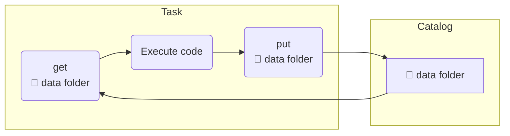

In **magnus**, we distinguish between 3 types of data that steps can communicate with each other.

[`Parameters`](#flow_of_parameters)

:   Parameters can be thought of input and output arguments of functions. Magnus supports
pydantic models both as input and return types of functions.

[`Files`](#flow_of_files)

:   Data files created by individual tasks of the pipeline can be passed to downstream tasks
using catalog. This can be controlled either by the configuration or by python API.

`Objects`

:   Pythonic objects, eg. pandas dataframes, to be passed to downstream tasks. Any ```pickle```
supported objects can be used.

## Flow of Parameters

Magnus stores the parameters in JSON serialized format in the run log. Individual tasks can
access them either as function arguments or as environment variables.

The initial parameters of the pipeline can set by using a ```yaml``` file.

=== "Initial Parameters"

    ```yaml title="Defining initial parameters"
    # The below is assumed to be examples/parameters_initial.yaml # (2)
    simple: 1
    inner: # (1)
        x: 3
        y: "hello"
    ```

    1. You can create deeply nested parameter structures.
    2. You can name it as you want.

=== "Pydantic model representation"

    The parameter structure can be represented as a pydantic model within your code.

    ```python title="Pydantic model representation"

    from pydantic import BaseModel

    class InnerModel(BaseModel): # (1)
        x: int
        y: str

    class NestedModel(BaseModel): # (2)
        simple: int
        inner: InnerModel

    ```

    1. Represents the ```inner``` nested model of parameters.
    2. Represents all parameters defined in initial parameters.


### Accessing parameters


=== "Application native way"

    !!! info annotate inline end "No ```import magnus``` !!!"

        A lot of design emphasis is to avoid "import magnus" and keep the function signature native to the application.
        Magnus also has API's get_parameter and set_parameter if they are handy.


    ```python hl_lines="32-51"
    --8<-- "examples/parameters.py"
    ```

    1. Create a pydantic model to represent the parameters.
    2. Access those parameters by name. The annotations are used to cast to correct models.
    3. Return the modified parameters for downstream steps. The return type should be always a pydantic model.


=== "Using the python API"

    !!! info annotate inline end "Using API"

        Using the python API gives you access to the parameters without changing the
        signature of the functions. Also, this the preferred way to access the parameters in
        notebooks. (1)

    1. We use parameters in notebooks but they can only support simple types while the
    API supports rich pydantic models.


    ```python hl_lines="42-70"
    --8<-- "examples/parameters_api.py"
    ```

    1. To get the parameters as pydantic models, you can hint the type using ```cast_as```
    2. Downstream steps could access the modified parameters.


=== "Using environment variables"

    !!! info annotate inline end "Using Env"

        Tasks of type shell use this mechanism to access parameters.

        There are richer ways to pass parameters in magnus if you are using only
        python in your application. This mechanism helps when you have non-python code
        as part of your application.


    ```yaml title="Using shell to access parameters"
    --8<-- "examples/parameters_env.yaml"
    ```

    1. Show all the parameters prefixed by MAGNUS_PRM_
    2. Set new values of the parameters as environment variables prefixed by MAGNUS_PRM_
    3. Consume the parameters like you would using python.


## Flow of Files

!!! info annotate inline end "Intuition"

    The idea of a "data" folder to contain files/artifacts is not an idiosyncrasy of magnus.
    AWS Sagemaker pipelines have a similar concept and commonly found pattern in data science projects.


**Magnus** stores all the artifacts/files/logs generated by ```task``` nodes in a central storage called ```catalog```.
The catalog is indexed by the ```run_id``` of the pipeline and is unique for every execution of the pipeline.

Any ```task``` of the pipeline can interact with the ```catalog``` to get and put artifacts/files as part
of the execution.

Conceptually, the flow is:

<div class="annotate" markdown>

</div>

The data folder in ```catalog``` has the same structure as the ```root``` of the project. You can access content
as if you are accessing files relative to the project root.

=== "Example Configuration"

    ``` yaml
    --8<-- "examples/configs/fs-catalog.yaml"
    ```

    1. Use local file system as a central catalog, defaults to ```.catalog```
    2. By default, use ```data``` folder as the location of users content.

=== "Pipeline in YAML"

    !!! info annotate "Python functions"

        We have used shell for these operations for convenience but you can use python functions to
        create content and retrieve content.

        For example, the below functions can be used in steps Create Content and Retrieve Content.
        ```python
        def create_content():
            with open("data/hello.txt") as f:
                f.write("hello from magnus")

        def retrieve_content():
            with open("data/hello.txt") as f:
              print(f.read())
        ```


    ``` yaml
    --8<-- "examples/catalog.yaml"
    ```

    1. Make a ```data``` folder if it does not already exist.
    2. As the ```compute_data_folder``` is defined to ```.```, all paths should be relative to ```.```. Put the file ```hello.txt``` in ```data``` folder into the catalog.
    3. We have intentionally made this ```stub``` node to prevent accidentally deleting your content. Please make it a ```task``` to actually delete the ```data``` folder.
    4. Should print "Hello from magnus" as the content of the ```hello.txt```.
    5. Override the default ```.``` as ```compute_data_folder``` to ```data```. All interactions should then be relative to ```data``` folder.
    6. Same as above, make it a ```task``` to actually delete the ```data``` folder

=== "Pipeline in Python"

    !!! info annotate "Python functions"

        We have used shell for these operations for convenience but you can use python functions to
        create content and retrieve content.

        For example, the below functions can be used in steps create and retrieve.
        ```python
        def create_content():
            with open("data/hello.txt") as f:
                f.write("hello from magnus")

        def retrieve_content():
            with open("data/hello.txt") as f:
              print(f.read())
        ```

    ```python
    --8<-- "examples/catalog.py"
    ```

=== "Using Python API"

    ```python
    --8<-- "examples/catalog_api.py"
    ```
