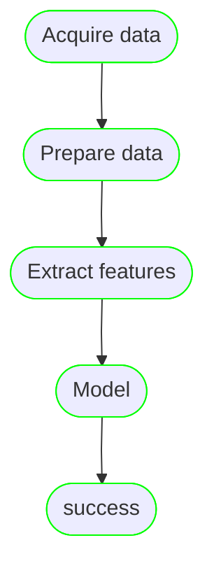

<figure markdown>
  { width="400" height="300"}
  <figcaption></figcaption>
</figure>

---

Successful data science projects require a varied set of skills from data scientists, ML engineers, and infrastructure
teams. Often, the roles and responsibilities of these personas are blurred leading to projects that are difficult to
maintain, test, reproduce or run at scale.

We build __**Magnus**__ to separate those concerns and create a clear boundary of the personas.

## Design principles:

`Code should not be mixed with implementation details of underlying platform.`

<div class="annotate" markdown>

**Example**: Data and parameters are often shared between different steps of the pipeline. (1)
The platform implementation should not add additional code to make this happen.

</div>

1.  :raised_hand: Think of them as functions returning values or creating files.


`Interactive development/debugging should be a first-class citizen.`

<div class="annotate" markdown>

**Example**: Data science teams thrive in environments with quick debug loop. Able to use their preferred tools
and iterate without constraints of the platform aids development/debugging (1).

</div>

1.  :raised_hand: The code should not move away from the comfort state of the data science teams; Minimize refactor.

`Align the best practices even during development phase.`

<div class="annotate" markdown>

**Example**: All projects require secrets to access secure content. The concept of secret should be
available even during development phase (1) and there should be no change in code when it is run in production set up.

</div>

1.  :ballot_box_with_check: Accessing secrets either from environment variables or files is acceptable
during development phase.


## What does it do?

Magnus is a thin abstraction layer over the services typically provided by production grade infrastructures. Independent
of the provider, it exposes a consistent interface to those services, **this holds true even for the local environment**.

<figure markdown>
  { width="1200" height="800"}
  <figcaption></figcaption>
</figure>

The scope of magnus is intentionally limited. It does not boast of end to end development. It acts only as a companion
during the development phase of data science projects.

## Example

A contrived example of data science workflow without any implementation.

!!! info annotate inline "Simple pipeline"

    In this extremely reduced example, we acquire data from different sources, clean it and shape it for analysis.
    Features are then engineered from the clean data to run data science modelling.

    We are intentionally hiding highly nuanced parts (1) of the pipeline to give you a flavor, please refer to the
    docs for more details.

1. Tolerating failures, data passing between steps, experiment tracking, logging and much more.




This pipeline can be represented in **magnus** as below:


=== "YAML"

    ``` yaml
    --8<-- "examples/contrived.yaml"
    ```

=== "Python"

    ``` python
    --8<-- "examples/contrived.py"
    ```

    1. You can specify dependencies by using the ```next``` while creating the node or defer it for later.
    2. ```terminate_with_success``` indicates the pipeline to be successfully run.
    3. Alternative ways to define dependencies, ```>>>```, ```<<<```, ```depends_on```. Choose the style that you
    prefer.
    4. ```add_terminal_nodes``` adds success and end states to the pipeline.
    5. A very rich run log that captures different properties of the run for maximum reproducibility.
