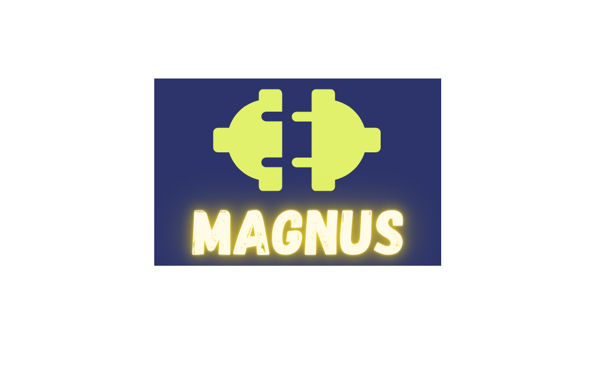

{ width="400" height="300" style="display: block; margin: 0 auto" }

---

We understand that data science is a highly iterative process conducted at the intersection of statistics, machine
learning, computer science. For a data scientist to be effective, there is a growing need to understand and thrive in
cloud infrastructure which can be a very steep learning curve and dangerous, if not done right.

The typical needs of data scientists are:

- Run job(s) (a notebook, python or R function) in a scalable environment.
- Ability to define the compute requirements, i.e CPU, GPU, memory, of the environment
- Ability to access data from data sources and modify it as needed.
- Ability to have access to secrets to make secure connections to data sources.
- Ability to track and record their experiments for later reference.

What is hidden from these needs are:

- portability of the function/notebook in the scalable environment.
- Robust reproducibility of any experiment.
- Frictionless movement to a production environment.
- Frictionless movement from production environment to development environment to debug and fix.

---

Magnus is written to provide to the data scientist requirements while ensuring the hidden best practices are maintained.

It allows a data scientist or a ML engineer to **decouple** the experiment from the environment by abstractions.

With Magnus, you can:

- Run a Jupyter notebook either on local machines or a cloud infrastructure without hassle.
- Run a python function either on local machines or a cloud infrastructure without hassle.
- Run pipelines either on local machines or a cloud infrastructure.
- Port a production pipeline onto local machines to debug and fix.

Where it differs from other tools in this area:

- There is no need to change the infrastructure patterns. Magnus is a transpiler to different cloud environments.
- The learning curve to use magnus is kept minimal and can be done either via Yaml or Python SDK.
- Extendable to fit to your needs.
- Lean footprint in the code base to revert to old state if magnus does not fit your needs.

---

:sparkles::sparkles:Happy Experimenting!!:sparkles::sparkles:

Please find the [github project here](https://github.com/AstraZeneca/magnus-core).
